# HW5 - Product API with Terraform and AWS ECS

A RESTful Product API for an e-commerce system, implemented in Go and deployed on AWS ECS using Terraform infrastructure-as-code.

## Project Structure

```
hw5/
├── .gitignore                                   # Git ignore rules
├── README.md                                    # This file
├── api.yaml                                     # OpenAPI specification
├── HW5 - Product API.postman_test_run.json      # Postman test results
├── HW5-Product-API.postman_collection.json      # Postman collection
├── locustfile_http.py                           # Load testing with HttpUser
├── locustfile_fast.py                           # Load testing with FastHttpUser
├── test_screenshots/                            # Test screenshots
├── src/
│   ├── main.go                                  # Product API server implementation
│   ├── go.mod                                   # Go module definition
│   ├── go.sum                                   # Dependency checksums
│   └── Dockerfile                               # Container definition
└── terraform/
    ├── main.tf                                  # Main infrastructure orchestration
    ├── variables.tf                             # Configurable parameters
    ├── provider.tf                              # AWS and Docker provider configuration
    ├── output.tf                                # Infrastructure outputs
    └── modules/
        ├── ecr/                                 # Docker registry
        ├── ecs/                                 # Container orchestration
        ├── alb/                                 # Load balancer
        ├── network/                             # VPC and security groups
        └── logging/                             # CloudWatch logs
```

**Note**: Terraform state files (`.tfstate`), sensitive configuration (`.tfvars`), and AWS credentials are excluded via `.gitignore`.

---

## Prerequisites

- Go 1.25+
- Docker
- AWS CLI configured with credentials
- Terraform 1.0+
- Python 3.x with Locust (for load testing)

---

## Local Development

### Run the Server Locally

```bash
cd src/

# Initialize Go module
go mod init hw5/product-api
go get github.com/gorilla/mux

# Run the server
go run main.go
```

Server starts on `http://localhost:8080`

### Test Locally with Docker

```bash
cd src/

# Build the image
docker build -t product-api:latest .

# Run the container
docker run -p 8080:8080 product-api:latest

# Test
curl http://localhost:8080/health
```

---

## AWS Deployment

### Initial Setup

1. **Configure AWS credentials** (get from AWS Academy):
```bash
aws configure
# Enter Access Key ID, Secret Access Key, and Session Token
aws configure set aws_session_token YOUR_SESSION_TOKEN
```

2. **Clone and navigate to project**:
```bash
cd terraform/
```

3. **Initialize Terraform**:
```bash
terraform init
```

4. **Deploy infrastructure**:
```bash
terraform apply -auto-approve
```

Deployment takes 10-15 minutes and creates:
- ECR repository for Docker images
- VPC networking and security groups
- Application Load Balancer
- ECS Fargate cluster with 1 task
- CloudWatch logging

5. **Get your API URL**:
```bash
terraform output api_url
```

### Updating the Deployment

```bash
# After code changes
cd terraform/
terraform apply -auto-approve
```

### Clean Up Resources

```bash
cd terraform/
terraform destroy
```

**Important**: Always destroy resources when done to avoid AWS charges.

---

## API Documentation

### Base URL
- **Local**: `http://localhost:8080`
- **AWS**: Output from `terraform output api_url`

### Endpoints

| Method | Endpoint | Description |
|--------|----------|-------------|
| GET | `/health` | Health check |
| GET | `/products/{productId}` | Get product by ID |
| POST | `/products/{productId}/details` | Add/update product |

### Response Codes

| Code | Meaning |
|------|---------|
| 200 | Success (GET) |
| 204 | Success (POST, no content) |
| 400 | Bad Request (invalid input) |
| 404 | Not Found (product doesn't exist) |
| 500 | Internal Server Error |

### Product Schema

```json
{
  "product_id": 12345,
  "sku": "ABC-123-XYZ",
  "manufacturer": "Acme Corporation",
  "category_id": 456,
  "weight": 1250,
  "some_other_id": 789
}
```

### API Examples

#### Health Check (200 OK)
```bash
curl http://YOUR_ALB_URL/health
# Response: OK
```

#### Add Product (204 No Content)
```bash
curl -X POST http://YOUR_ALB_URL/products/12345/details \
  -H "Content-Type: application/json" \
  -d '{
    "product_id": 12345,
    "sku": "ABC-123-XYZ",
    "manufacturer": "Acme Corporation",
    "category_id": 456,
    "weight": 1250,
    "some_other_id": 789
  }'
```

#### Get Product (200 OK)
```bash
curl http://YOUR_ALB_URL/products/12345
```

#### Product Not Found (404)
```bash
curl http://YOUR_ALB_URL/products/99999
# Response: {"error":"NOT_FOUND","message":"Product not found"}
```

#### Invalid Product ID (400)
```bash
curl http://YOUR_ALB_URL/products/-1
# Response: {"error":"INVALID_INPUT","message":"Product ID must be a positive integer"}
```

### Postman Collection

A complete Postman collection with all test cases is available in `HW5-Product-API.postman_collection.json`. Import this file into Postman to run all API tests.

**Automated Test Results** (AWS deployment):
- Total requests tested: 11
- Success rate: 100%
- Average response time: 40ms
- All HTTP status codes validated (200, 204, 400, 404)

See `HW5 - Product API.postman_test_run.json` for detailed test execution results.

---

## Load Testing Results

Load testing was performed using Locust with both `HttpUser` and `FastHttpUser` at various load levels.

### Test Configuration

**Infrastructure**: Single ECS Fargate task (256 CPU units, 512MB RAM)

| Test | Users | Spawn Rate | Duration | User Type |
|------|-------|------------|----------|-----------|
| 1 | 50 | 5/sec | 60s | HttpUser |
| 2 | 50 | 5/sec | 60s | FastHttpUser |
| 3 | 100 | 10/sec | 120s | HttpUser |
| 4 | 100 | 10/sec | 120s | FastHttpUser |
| 5 | 1000 | 100/sec | 180s | HttpUser |
| 6 | 1000 | 100/sec | 180s | FastHttpUser |

### Results Summary

#### Test 1: HttpUser - 50 Users
- **Total RPS**: 24.9
- **Avg Response Time**: 30.16ms
- **Median**: 28ms
- **95th Percentile**: 43ms
- **Failures**: 0%
- **Total Requests**: 1,551
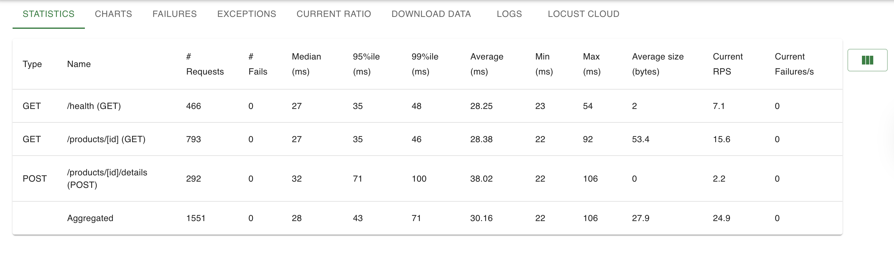
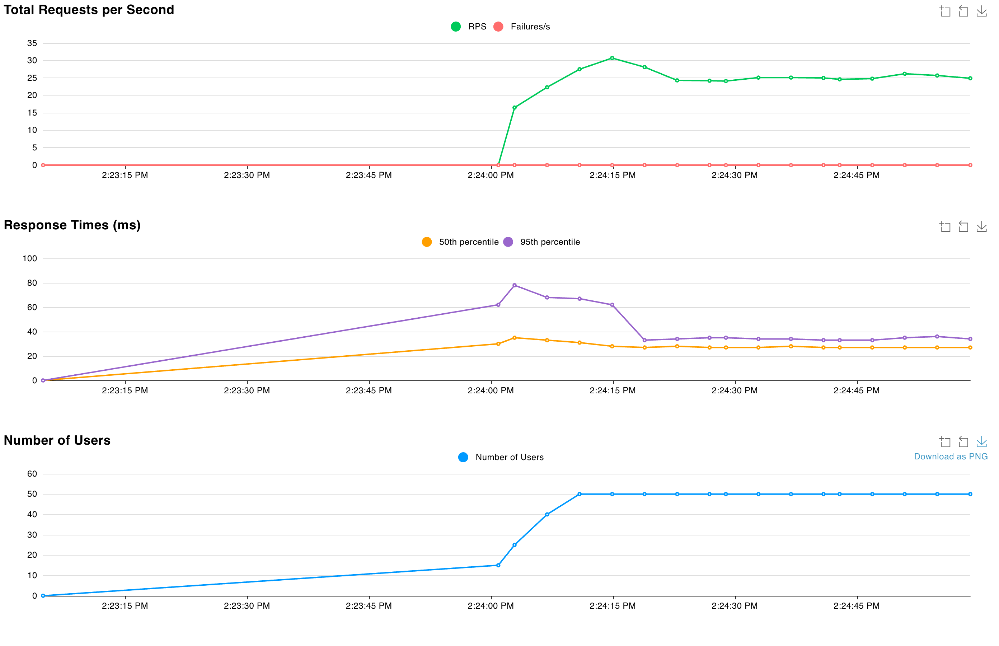
#### Test 2: FastHttpUser - 50 Users  
- **Total RPS**: 24.2
- **Avg Response Time**: 27.93ms
- **Median**: 26ms
- **95th Percentile**: 34ms
- **Failures**: 0%
- **Total Requests**: 1,541
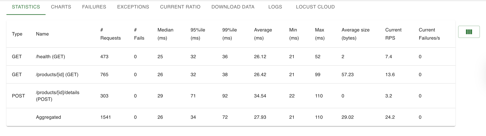
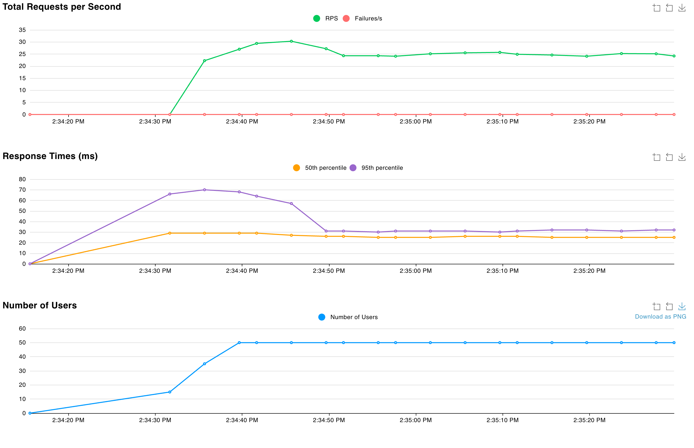

#### Test 3: HttpUser - 100 Users
- **Total RPS**: 49.5
- **Avg Response Time**: 29.89ms
- **Median**: 28ms
- **95th Percentile**: 40ms
- **Failures**: 0%
- **Total Requests**: 6,033
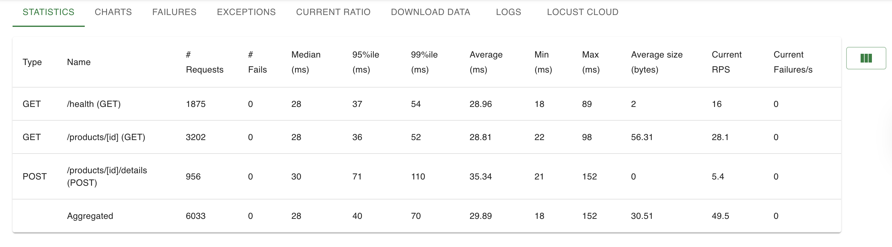


#### Test 4: FastHttpUser - 100 Users
- **Total RPS**: 50.3
- **Avg Response Time**: 27.18ms
- **Median**: 26ms
- **95th Percentile**: 33ms
- **Failures**: 0%
- **Total Requests**: 6,029
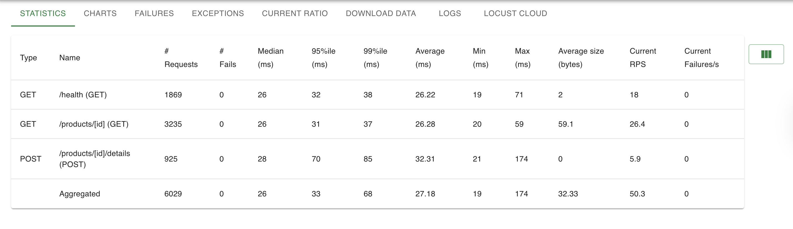
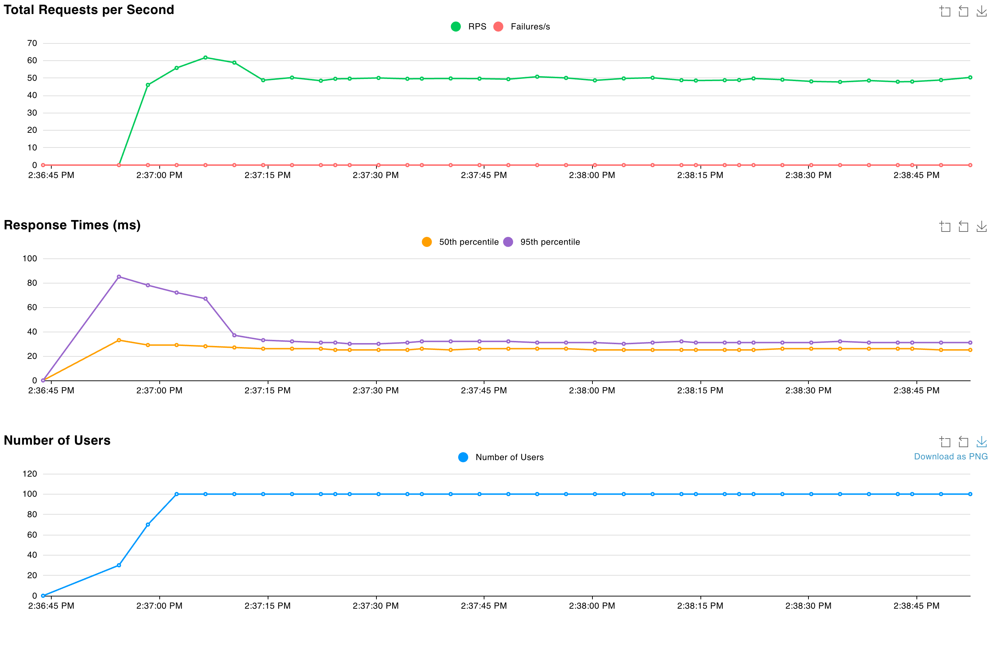

#### Test 5: HttpUser - 1000 Users (High Load)
- **Total RPS**: 492.4
- **Avg Response Time**: 33.24ms
- **Median**: 31ms
- **95th Percentile**: 46ms
- **99th Percentile**: 100ms
- **Failures**: 0%
- **Total Requests**: 89,643
- **GET /products**: 273.4 RPS (31.97ms avg)
- **POST /products**: 55.6 RPS (41.02ms avg)
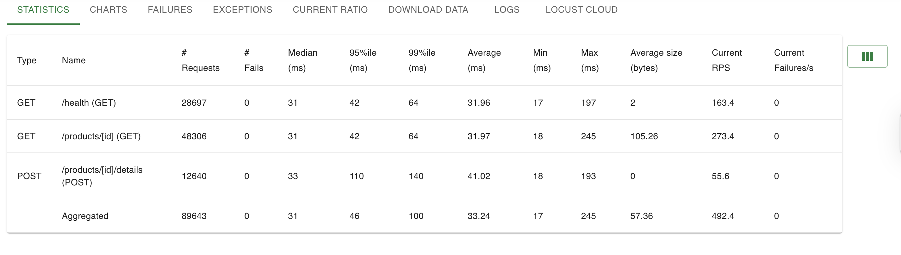
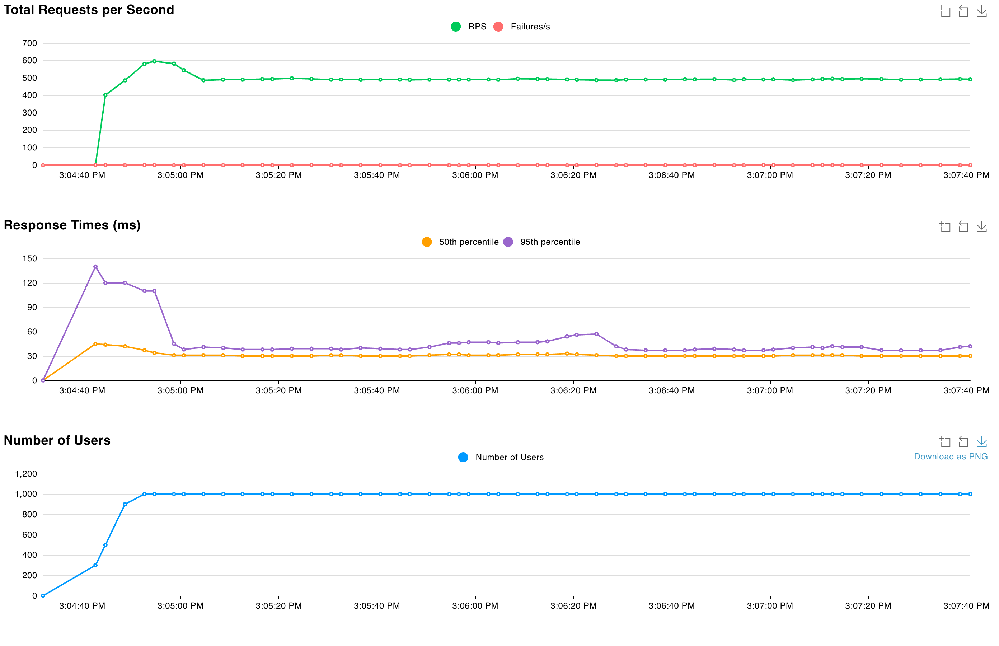

#### Test 6: FastHttpUser - 1000 Users (High Load)
- **Total RPS**: 488.9
- **Avg Response Time**: 30.53ms
- **Median**: 29ms
- **95th Percentile**: 38ms
- **99th Percentile**: 95ms
- **Failures**: 0%
- **Total Requests**: 89,898
- **GET /products**: 265 RPS (29.45ms avg)
- **POST /products**: 55.8 RPS (37.29ms avg)
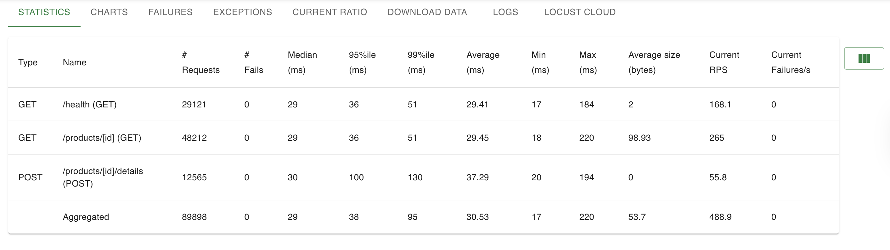
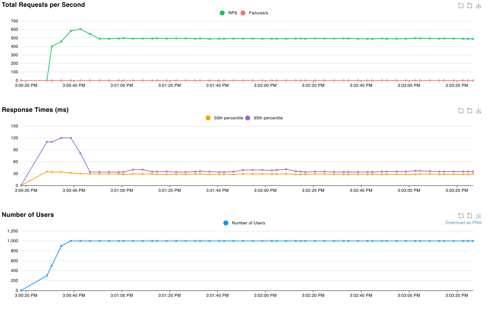

### Key Findings

1. **Performance Comparison Across Load Levels**:
   - **At 50 users**: FastHttpUser 7% faster (27.93ms vs 30.16ms)
   - **At 100 users**: FastHttpUser 9% faster (27.18ms vs 29.89ms)
   - **At 1000 users**: FastHttpUser 8% faster (30.53ms vs 33.24ms)
   - Similar throughput (RPS) at all levels due to single-container bottleneck

2. **Response Time Consistency**:
   - FastHttpUser maintains lower and more consistent response times
   - HttpUser shows slightly more variance under high load
   - 99th percentile: FastHttpUser (95ms) vs HttpUser (100ms) at 1000 users

3. **Server Capacity Limitation**:
   - Single ECS task peaked at ~50 RPS (50-100 users) and ~490 RPS (1000 users)
   - Server capacity, not client efficiency, was the primary bottleneck
   - Both user types reached the container's maximum throughput

4. **Why FastHttpUser Shows Modest Improvements**:
   - **Connection pooling**: Reuses HTTP connections, reducing overhead
   - **Lower CPU per request**: More efficient at scale
   - **Better under saturation**: Performance advantage increases with load
   - **Limited by server**: Single container caps potential benefits

5. **Zero Failure Rate**:
   - 0% failure rate across all 6 tests and 187,000+ requests
   - Demonstrates API robustness under various load conditions
   - Consistent performance even at 10x baseline load (1000 vs 100 users)

6. **When FastHttpUser Matters Most**:
   - Multiple backend servers allow connection pooling benefits to shine
   - Higher server capacity reveals client-side efficiency gains
   - At current single-task capacity, improvements are modest but measurable

### Bottleneck Analysis

The single ECS container (256 CPU, 512MB RAM) reached maximum capacity around 490-500 RPS with 1000 concurrent users. Performance remained stable with no failures, but throughput plateaued regardless of client type.

**To achieve higher throughput:**

- **Horizontal scaling**: Increase to 3-5 ECS tasks
  - Expected: ~1,500-2,000 RPS (3x improvement)
  - Load distributed across multiple containers
  
- **Vertical scaling**: Upgrade to 512 CPU / 1024MB RAM per task
  - Expected: ~800-1,000 RPS per task (2x improvement)
  - Better for CPU-intensive operations

- **Combined approach**: 3 tasks with 512 CPU each
  - Expected: ~2,400-3,000 RPS total
  - Best balance of cost and performance

**Current Performance Characteristics:**
- Linear scaling up to ~50 RPS (low load)
- Plateau at ~490 RPS (saturation point)
- Stable response times even under saturation
- Zero degradation or failures

---

## Architecture & Design Decisions

### Current Architecture

```
Internet → ALB (Port 80) → ECS Fargate Task (Port 8080) → In-Memory Storage
                              ↓
                          CloudWatch Logs
```

**Components**:
- **Application Load Balancer**: Provides stable endpoint, health checks
- **ECS Fargate**: Serverless container execution (no EC2 management)
- **ECR**: Private Docker registry
- **CloudWatch**: Centralized logging
- **VPC**: Network isolation with security groups

### Design Rationale

#### In-Memory Storage (HashMap)
**Pros**:
- O(1) lookup and insert time
- Simple implementation
- Fast for read-heavy workloads

**Cons**:
- Data lost on container restart
- Limited to single instance (no sharing between tasks)
- No persistence

**Production Alternative**: PostgreSQL or DynamoDB with Redis caching layer

#### Concurrency Control (RWMutex)
- Allows multiple concurrent readers
- Exclusive lock only for writes
- Prevents race conditions during load testing
- Optimal for read-heavy workloads (80% reads, 20% writes)

#### Container Platform (ARM64 vs AMD64)
Built for `linux/amd64` to ensure compatibility with AWS Fargate, even when developing on Apple Silicon (ARM64) Macs:

```dockerfile
FROM --platform=linux/amd64 golang:1.25-alpine AS builder
RUN CGO_ENABLED=0 GOOS=linux GOARCH=amd64 go build ...
```

### Scalable Backend Design

For a production e-commerce system with the full API (Products, Shopping Cart, Warehouse, Payments):

#### Microservices Architecture
```
API Gateway
    ↓
├── Product Service (this implementation)
├── Shopping Cart Service
├── Warehouse Service
└── Payment Service
```

#### Technology Stack
- **API Gateway**: Kong/AWS API Gateway for routing and rate limiting
- **Load Balancer**: AWS ALB for traffic distribution
- **Databases**: 
  - PostgreSQL for products (ACID compliance)
  - DynamoDB for shopping carts (fast key-value lookups)
  - Redis for session data and caching
- **Message Queue**: AWS SQS/RabbitMQ for async operations (order processing)
- **Monitoring**: CloudWatch metrics + distributed tracing (X-Ray)

#### Scaling Strategies
1. **Horizontal scaling**: Auto-scaling ECS tasks based on CPU/RPS
2. **Database read replicas**: Separate read and write traffic
3. **CDN**: CloudFront for static content
4. **Circuit breakers**: Prevent cascading failures
5. **Multi-AZ deployment**: High availability across availability zones

#### Data Consistency
- **Product catalog**: Strong consistency (PostgreSQL)
- **Shopping cart**: Eventual consistency acceptable (DynamoDB)
- **Inventory**: Distributed transactions (two-phase commit or saga pattern)
- **Payments**: External service with idempotency keys

---

## Terraform: Declarative vs Imperative

### Declarative Language
**Terraform describes WHAT you want, not HOW to build it.**

**Example**:
```hcl
resource "aws_ecs_service" "this" {
  desired_count = 3
}
```

Terraform figures out:
- Are there 0 tasks? Create 3
- Are there 5 tasks? Delete 2
- Are there 3 tasks? Do nothing

### Imperative Language (Traditional Scripting)
**Describes step-by-step HOW to do something.**
- Example: "Create instance 1, create instance 2, create instance 3"


**Example**:
```bash
# Must manually handle all cases
current=$(get_task_count)
if [ $current -lt 3 ]; then
  for i in $(seq $current 3); do
    create_task
  done
fi
```

### Benefits for Infrastructure

1. **Idempotency**: Run `terraform apply` multiple times safely
2. **State Management**: Terraform tracks what exists vs what should exist
3. **Dependency Resolution**: Automatically determines resource creation order
4. **Drift Detection**: Identifies manual changes outside Terraform
5. **Version Control**: Infrastructure changes tracked in Git
6. **Collaboration**: Multiple team members work with same state

**Example Benefit**:
```bash
# Change one variable
ecs_count = 1 → 3

# Terraform automatically:
# - Creates 2 new tasks
# - Registers them with load balancer
# - Waits for health checks
# - Updates service
```