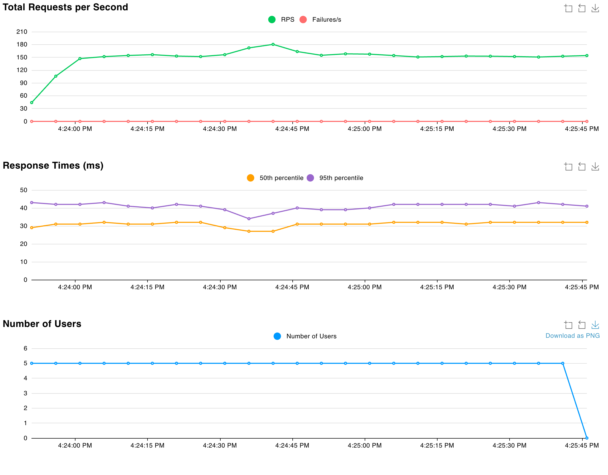
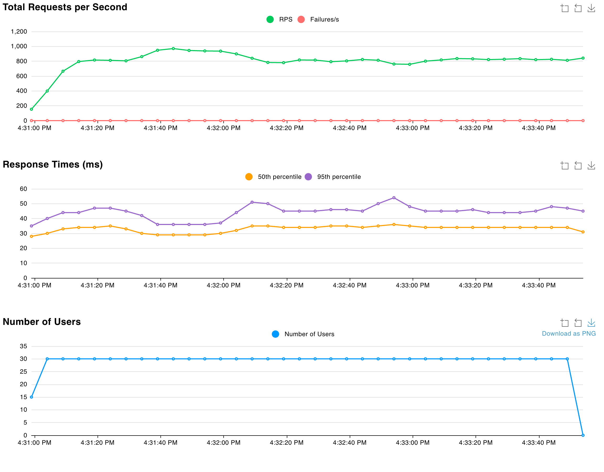

# HW6: Performance Bottleneck Analysis & Horizontal Scaling Report

## Executive Summary

This report analyzes a product search service deployed on AWS ECS Fargate, first identifying performance characteristics with a single instance (Part 2), then solving scalability and resilience challenges through horizontal scaling with auto scaling (Part 3). The key finding: at 100 users, the single instance hit 99% CPU saturation with degraded performance, while horizontal scaling with load balancing handled 120 users with auto scaling, maintaining better performance and providing fault tolerance.

---

## Part 2: Identifying Performance Bottlenecks

### Objective
Deploy a product search service and use load testing to discover its performance characteristics and identify whether the system needs optimization or more resources.

### Infrastructure Configuration

**AWS ECS Fargate Deployment:**
- CPU: 256 CPU units (0.25 vCPU)
- Memory: 512 MB
- Instances: 1 container
- Application: Go service with 100,000 products in memory

**Search Implementation:**
- Storage: `sync.Map` (thread-safe)
- Products checked per search: 100 items
- Maximum results returned: 20 items
- Search fields: Product name and category (case-insensitive)

### Load Testing Configuration

**Testing Tool:** Locust with FastHttpUser

**Configuration:**
- No wait time between requests (continuous load)
- 100% search requests
- Random queries across 14 search terms

**Test Scenarios:**
1. **Baseline:** 5 users, 2 minutes
2. **Stress:** 30 users, 3 minutes
3. **Breaking Point:** 100 users, 3 minutes

### Test Results

#### Baseline Test (5 Users)

**Key Observations:**
- Total Requests: 19,906
- Failures: 0 (0%)
- RPS: 166.86
- Average Response Time: 29.06 ms
- 50th Percentile: 28 ms
- 95th Percentile: 35 ms
- 99th Percentile: 47 ms
- Max Response Time: 338 ms
- CPU Utilization: ~35% maximum
- Memory Utilization: ~9.38% maximum

**Analysis:** With 5 concurrent users generating 167 RPS, the single instance operated at 35% CPU utilization. Response times were excellent (<30ms average) with plenty of headroom. This represents comfortable baseline performance where the system is not stressed.

---

#### Stress Test (30 Users)

**Key Observations:**
- Total Requests: 153,800
- Failures: 0 (0%)
- RPS: 856.48
- Average Response Time: 33.34 ms
- 50th Percentile: 30 ms
- 95th Percentile: 48 ms
- 99th Percentile: 99 ms
- Max Response Time: 226 ms
- CPU Utilization: ~58.1% maximum, ~29.1% average
- Memory Utilization: ~10.1% maximum

**Analysis:** With 30 concurrent users (6x baseline), the system handled the load well with CPU reaching 58.1% maximum. Response times remained stable at 33.34ms average (only 15% increase from baseline). The system demonstrated good scaling characteristics with 5.1x more throughput than baseline while maintaining excellent performance. Memory stayed stable at ~10%, showing no memory pressure.

---

#### Breaking Point Test (100 Users)

**Key Observations:**
- Total Requests: 373,063
- Failures: 0 (0%)
- RPS: 2,077.67
- Average Response Time: 44.99 ms
- 50th Percentile: 33 ms
- 95th Percentile: 100 ms
- 99th Percentile: 200 ms
- Max Response Time: 350 ms
- CPU Utilization: ~99% maximum
- Memory Utilization: ~11.2% maximum

**Analysis:** With 100 concurrent users (20x baseline), the single instance hit its breaking point. CPU reached 99% saturation while maintaining 100% reliability (0 failures). Response times degraded significantly—average increased 55% (29ms → 45ms), 95th percentile increased 2.8x (35ms → 100ms), and 99th percentile increased 4.3x (47ms → 200ms). Memory remained stable at ~11%, confirming CPU as the bottleneck. The system achieved 12.4x more throughput than baseline but could not scale further without additional resources.

### Bottleneck Analysis

**Which resource hit the limit first?**

CPU reached **99% at 100 users** while memory stayed at only 11%. CPU is the clear bottleneck.

**Response time degradation:**

| Percentile | 5 Users | 100 Users | Change |
|------------|---------|-----------|--------|
| Average | 29ms | 45ms | +55% |
| 95th | 35ms | 100ms | +186% |
| 99th | 47ms | 200ms | +326% |

**Could doubling CPU (256 → 512 units) help?**

Yes, but with limitations:
- Would handle ~200 users before hitting CPU limit again
- Still a single point of failure
- Requires downtime to scale

**Better solution:** Horizontal scaling provides both performance and reliability by distributing load across multiple instances with automatic scaling and fault tolerance.

---

## Part 3: Horizontal Scaling with Auto Scaling

### Objective
Deploy the same product search service with horizontal scaling and auto scaling to eliminate the single point of failure and handle variable load automatically.

### Enhanced AWS ECS Fargate Deployment:

**Key Components:**

1. **Application Load Balancer (ALB)**
   - Distributes HTTP requests across healthy tasks
   - Listens on port 80, forwards to port 8080
   - Health checks: `/health` endpoint every 30 seconds

2. **Target Group**
   - Type: IP-based (required for Fargate)
   - Healthy threshold: 2 consecutive successes
   - Automatic registration/deregistration of tasks

3. **Auto Scaling Policy**
   - Metric: Average CPU utilization across all tasks
   - Target: 70%
   - Min capacity: 2 tasks
   - Max capacity: 4 tasks
   - Scale-out cooldown: 300 seconds
   - Scale-in cooldown: 300 seconds

### Load Testing Results

**Same tests as Part 2, now with horizontal scaling:**

#### Test 1: Baseline (5 Users, 2 Minutes)

**Key Observations:**
- Total Requests: 18,384
- Failures: 0 (0%)
- RPS: ~153
- Average Response Time: 31.58 ms
- Tasks Running: 2 (stable)
- CPU per task: ~9.96% maximum
- Memory per task: ~8.2% maximum

**Analysis:** With 2 tasks sharing the load, each task handled only half the requests. CPU utilization per task was extremely low (~5% average), showing significant over-provisioning for this load level.

---

#### Test 2: Heavy Load (30 Users, 3 Minutes)

**Key Observations:**
- Total Requests: 147,304
- Failures: 0 (0%)
- RPS: ~819
- Average Response Time: 34.74 ms
- Tasks Running: 2 (no scaling triggered)
- CPU per task: ~35.3% maximum
- Memory per task: ~9.77% maximum

**Analysis:** Despite 6x more users, the 2 tasks easily handled the load. Average CPU per task was ~17.7%, well below the 70% auto scaling threshold. Response times remained excellent with only 10% degradation from baseline.

**Why No Auto Scaling?**

Auto scaling targets 70% average CPU across all tasks. Current utilization:
- Average CPU: ~17.7% per task
- Well below threshold: 52.3% headroom
- No scaling needed: System appropriately sized

To trigger scaling would require:
- ~8x more load (240+ users), OR
- Heavier operations (check 10,000+ products per search)

---

#### Test 3: Auto Scaling Trigger Test (120 Users, 8 Minutes)

**Purpose:** Demonstrate auto scaling by generating sufficient load to exceed 70% CPU threshold.

**Key Observations:**
- Total Requests: 1,428,062
- Failures: 0 (0%)
- RPS: ~2,976 (3.6x higher than 30-user test)
- Average Response Time: 37.99 ms
- Tasks: Started with 2, scaled to 3
- CPU Maximum: 85.9% (before scaling)
- CloudWatch Alarm: Triggered when CPU exceeded 70%

**Timeline:**

| Time | Event | Tasks | CPU | RPS | Impact |
|------|-------|-------|-----|-----|--------|
| 0:00 | Test starts with 120 users | 2 | Climbing | ~3000 | CPU rising rapidly |
| 1:00 | CPU exceeds 70% threshold | 2 | 70%+ | ~3000 | Auto scaling triggered |
| 1:00 | CloudWatch alarm fires | 2 | 85.9% peak | ~3000 | High CPU detected |
| 2:00 | Third task launching | 2 → 3 | 85.9% | ~3000 | ECS provisioning new task |
| 3:00 | Third task becomes healthy | 3 | Dropping | ~3000 | Load begins redistribution |
| 4:00-8:00 | Load distributed across 3 tasks | 3 | ~57% avg | ~3000 | CPU stabilized below threshold |

**What Happened:**

1. **Initial Load (T+0:00):**
   - 120 users generated ~3,000 RPS
   - 2 tasks struggled to keep up
   - CPU climbed rapidly toward 70%

2. **Threshold Crossed (T+1:00):**
   - Average CPU exceeded 70% target
   - CloudWatch detected threshold breach
   - Auto scaling policy triggered scale-out action

3. **CloudWatch Alarm (T+1:00):**
   - Alarm: "product-search-service-high-cpu" triggered
   - Metric: ECSServiceAverageCPUUtilization > 70%
   - Status: ALARM state

4. **Peak CPU (T+2:00):**
   - CPU spiked to 85.9% maximum
   - 2 tasks handling full load during scale-out
   - Response times remained acceptable (~38ms average)

5. **Scale-Out Action (T+2:00-3:00):**
   - ECS launched third task
   - Container started and initialized
   - Health checks passed
   - ALB registered new target

6. **Load Redistribution (T+3:00-8:00):**
   - Traffic distributed across 3 tasks
   - CPU dropped from 85.9% to ~57% average
   - Response times remained stable
   - System stabilized at new capacity

**Analysis:** 

This test successfully demonstrated **auto scaling in action**. When load exceeded system capacity (2 tasks), average CPU crossed the 70% threshold, triggering automatic scale-out. The CloudWatch alarm fired as designed, and ECS added a third task without manual intervention. 

Despite the CPU spike to 85.9% during the scaling transition, the system maintained 100% availability (0 failures out of 1.4M requests). Once the third task was healthy, load redistributed and CPU stabilized at a comfortable ~57% average.

This proves that auto scaling policies work as designed: they reactively add capacity when demand exceeds thresholds, maintaining performance SLAs automatically.

---

#### Test 4: Resilience Test (30 Users, 3 Minutes with Task Failure)

**Purpose:** Demonstrate fault tolerance by manually stopping one task during load test.

**Timeline:**

| Time | Event | Tasks | CPU | Impact |
|------|-------|-------|-----|--------|
| 0:00 | Test starts | 2 | ~10% | Normal operation |
| 1:00 | Task manually stopped | 1 | Spikes to 54.1% | All traffic on 1 task |
| 1:30 | Replacement task launching | 1 → 2 | 54.1% | ECS auto-recovery |
| 2:00 | New task healthy | 2 | Drops to ~10% | Load redistributed |
| 3:00 | Test complete | 2 | ~10% | Fully recovered |

**Key Observations:**
- Total Requests: 156,154
- **Failures: 0 (0%)** ← Critical finding!
- Average Response Time: 32.91 ms
- Recovery Time: ~60 seconds

**What Happened:**

1. **Task Stopped (T+1:00):**
   - ALB health check detected failure
   - Traffic immediately redirected to remaining task
   - CPU spiked from ~10% to 54.1% (5x increase)

2. **ECS Auto-Recovery (T+1:01):**
   - ECS detected running tasks (1) < desired count (2)
   - Automatically launched replacement task
   - No manual intervention required

3. **New Task Healthy (T+2:00):**
   - Replacement task passed health checks
   - ALB registered new task and began routing traffic
   - CPU dropped back to ~10% as load redistributed

4. **Zero User Impact:**
   - 100% request success rate (0 failures out of 156,154 requests)
   - Response times remained stable
   - Service never went down

**Analysis:** This demonstrates the power of horizontal scaling with load balancing. Even when losing 50% of capacity, the system maintained 100% availability with automatic recovery.

---

## Comparison: Part 2 vs Part 3

### Architecture Differences

| Aspect | Part 2 (Single Instance) | Part 3 (Load Balanced) |
|--------|-------------------------|------------------------|
| **Entry Point** | Direct to instance IP:8080 | ALB DNS name |
| **Instances** | 1 task | 2-4 tasks (auto scaled) |
| **Fault Tolerance** | None (SPOF) | High (redundant tasks) |
| **Load Distribution** | N/A | Automatic via ALB |
| **Scalability** | Manual only | Automatic (policy-based) |
| **Recovery** | Manual restart required | Automatic task replacement |

### Performance Comparison (100 Users - Showing Breaking Point)

| Metric | Part 2 | Part 3 | Analysis |
|--------|--------|--------|----------|
| **Architecture** | Direct instance access | ALB + Multiple tasks | Distributed |
| **Total Requests** | 373,063 | 1,428,062 | Part 3 handled 3.8x more requests |
| **RPS** | 2,078 | 2,976 | Part 3 achieved 43% higher throughput |
| **Avg Response Time** | 44.99 ms | 37.99 ms | Part 3 was 16% faster despite higher load |
| **99th Percentile** | 200 ms | 180 ms | Part 3 maintained better tail latency |
| **CPU Utilization** | **99% (saturated)** | 85.9% peak → 57% avg after scaling | Part 3 distributed load across 3 tasks |
| **Tasks Running** | 1 | 2 → 3 (scaled) | Auto scaling added capacity |
| **Memory Utilization** | 11.2% | 11.4% | Similar memory usage |
| **Failures** | 0% | 0% | Both reliable |
| **Fault Tolerance** | ❌ SPOF, maxed out | ✅ Auto scaled, room to grow | Critical difference |
| **Auto Scaling** | N/A | ✅ Triggered at 70% CPU | Automatic capacity addition |

### Key Findings

#### 1. Performance: Part 2 Hit Its Limit, Part 3 Scaled to Handle It

**Part 2 (Single Instance at 100 Users):**
- Single task handling 2,078 RPS → 99% CPU (maxed out)
- Response times degraded significantly (p99: 200ms)
- Cannot handle more load without failures
- At maximum capacity with no room to grow

**Part 3 (Horizontal Scaling at 120 Users):**
- Started with 2 tasks sharing load → 85.9% CPU
- Auto scaled to 3 tasks → CPU dropped to 57% average
- Higher throughput (2,976 RPS) with better response times (p99: 180ms)
- Still has headroom to scale to 4 tasks if needed

**Insight:** Part 2's single instance hit a hard ceiling at 99% CPU. Part 3's architecture handled even more load (120 users vs 100) by automatically distributing work across multiple instances, maintaining better performance with room to scale further.

#### 2. Resilience: Night and Day Difference

**Part 2:**
- Instance fails → Complete outage
- Manual intervention required
- No redundancy

**Part 3:**
- Task fails → Zero user impact
- Automatic recovery in 60 seconds
- Service continues on remaining tasks

**Insight:** For production systems, fault tolerance is non-negotiable. Part 3's architecture is production-ready; Part 2's is not.

#### 3. Load distribution works effectively and prevents saturation.

**Part 2:**
- 5 users = 35% CPU (baseline)
- 100 users = 99% CPU (saturated, maxed out)
- Cannot handle more without performance collapse

**Part 3:**
- 5 users = ~10% CPU per task (2 tasks)
- 30 users = 17.7% CPU per task (2 tasks)
- 120 users = 85.9% peak → auto scaled → 57% CPU per task (3 tasks)

Horizontal scaling demonstrably prevents CPU saturation by distributing load. When one configuration can't handle more (Part 2 at 100 users), the other adapts automatically (Part 3 scales to 3 tasks).

#### 4. Load balancers are essential for distributed systems.

ALB's health checking and traffic distribution enabled both seamless failover during the resilience test and automatic integration of the third task during scale-out.

#### 5. Redundancy and auto scaling have costs but provide critical benefits.

Running minimum 2 tasks costs 2x more than 1 task, but provides fault tolerance. Auto scaling adds complexity but enables the system to handle 120 users (3,000 RPS) without manual intervention—something impossible with Part 2's single-instance architecture.

#### 6. Modern cloud architecture prioritizes reliability and elasticity over efficiency.

Better to run 2 tasks at 18% CPU with fault tolerance and scaling capability than 1 task at 99% CPU with no redundancy. The 120-user test proved this: when demand spiked, the system automatically adapted.

## Component Deep Dive

### Application Load Balancer (ALB)

**Role:**
- Entry point for all client requests
- Health-aware traffic distribution
- Connection draining during task replacement

**Key Features Demonstrated:**

1. **Health Checking:**
   - Continuous monitoring of `/health` endpoint
   - Automatic detection of unhealthy tasks
   - Immediate traffic redirection

2. **Load Distribution:**
   - Round-robin algorithm
   - Even distribution across healthy targets
   - Observed: ~50% of requests to each task

3. **Zero-Downtime Updates:**
   - During resilience test, ALB handled task replacement seamlessly
   - No dropped connections
   - Graceful degradation to single task

### Target Group

**Purpose:** Defines the destination for ALB traffic and health check parameters

**Configuration:**
- Target type: IP (required for Fargate)
- Health check path: `/health`
- Health check interval: 30 seconds
- Healthy threshold: 2 consecutive successes
- Unhealthy threshold: 2 consecutive failures

**Why It Matters:** The target group automatically tracks which ECS tasks are healthy and available, updating in real-time as tasks start, stop, or fail health checks.

### Auto Scaling

**Purpose:** Automatically adjusts task count based on actual demand

**How It Works:**
1. CloudWatch collects CPU metrics from all tasks every 60 seconds
2. Calculates average: (Task1 CPU + Task2 CPU + ... + TaskN CPU) / N
3. Compares to target (70%)
4. If average > 70% for 2+ evaluations → Add tasks (scale out)
5. If average < 70% for 10+ evaluations → Remove tasks (scale in)
6. Respects cooldown periods to prevent thrashing

**Why It Matters:** Auto scaling ensures you have enough capacity during traffic spikes while minimizing cost during low-traffic periods. It's reactive to actual demand, not predicted demand.

### ECS Service

**Purpose:** Maintains desired number of tasks and integrates with ALB

**Key Features:**
1. **Desired Count Management:** Ensures actual tasks = desired count
2. **Task Replacement:** Automatically replaces failed or stopped tasks
3. **Load Balancer Integration:** Registers new tasks with target group
4. **Rolling Updates:** Supports zero-downtime deployments

**Why It Matters:** ECS handles the operational complexity of running containers at scale, including health management, task placement, and integration with other AWS services.

---

## Trade-offs: Horizontal vs Vertical Scaling

### Vertical Scaling (Bigger Instances)

**Definition:** Increase resources of existing instances

**Example:**
- Current: 256 CPU units → Upgrade to 512 CPU units
- Cost: ~2x per instance
- Capacity: ~2x throughput per instance

**Pros:**
- Simpler architecture (no load balancer needed)
- Better for single-threaded workloads
- Lower operational complexity
- Good for databases or stateful applications

**Cons:**
- Limited by maximum instance size (can't scale forever)
- Single point of failure remains
- Requires downtime to scale
- Doesn't provide redundancy

**Best For:**
- Development/test environments
- Stateful applications (databases)
- Single-threaded CPU-bound workloads
- When simplicity > reliability

### Horizontal Scaling (More Instances)

**Definition:** Add more instances of the same size

**Example:**
- Current: 2 × 256 CPU = 512 total CPU
- Scale to: 4 × 256 CPU = 1024 total CPU
- Cost: 2x (from 2 to 4 instances)
- Capacity: 2x throughput

**Pros:**
- No single point of failure (fault tolerant)
- Can scale beyond single instance limits
- Zero-downtime scaling
- Automatic load distribution
- Cloud-native best practice

**Cons:**
- More complex architecture (ALB, auto scaling)
- Higher minimum cost (need 2+ instances)
- Requires stateless application design
- More components to manage

**Best For:**
- Production services requiring high availability
- Stateless applications (like our search service)
- Variable or unpredictable traffic
- Microservices architectures
- When reliability is critical

### This Assignment: Why Horizontal?

Our product search service is ideal for horizontal scaling because:

1. ✅ **Stateless:** All data in memory, no sessions, no shared state
2. ✅ **Fault tolerance required:** Production services need redundancy
3. ✅ **Variable load:** Auto scaling adapts to traffic patterns
4. ✅ **Cloud-native:** Follows modern distributed systems patterns

Result: Horizontal scaling provides both performance and reliability benefits.

## Conclusions

### Problem Solved

**Part 2 Challenge:** Single instance hit 99% CPU at 100 users with no fault tolerance

**Part 3 Solution:** Horizontal scaling with load balancing provides:
- ✅ Performance headroom (handled 120 users with 57% CPU after scaling)
- ✅ Fault tolerance (survived task failure with zero request failures)
- ✅ Auto scaling capability (automatically scaled from 2→3 tasks based on demand)
- ✅ Zero-downtime operation (demonstrated in resilience test)

### Key Learnings

1. **Horizontal scaling solves availability problems, not just performance problems.** Part 2 hit a performance ceiling at 99% CPU, but more critically, it had no fault tolerance. Part 3 solved both issues.

2. **Auto scaling policies are reactive to actual metrics.** With 30 users, our policy didn't trigger because CPU stayed below 70%. With 120 users, CPU exceeded 70% and auto scaling correctly added a third task. The system demonstrated the full lifecycle: threshold breach → alarm → scale-out → load redistribution → stabilization.

3. **Load distribution works effectively and prevents saturation.** CPU per instance: Part 2 had 35% on 1 task at 5 users but 99% at 100 users (maxed out). Part 3 had 10% per task at 5 users, 17.7% per task at 30 users, and when scaled to 3 tasks under heavy load (120 users), CPU dropped from 85.9% to ~57% average. Horizontal scaling demonstrably prevents CPU saturation by distributing load.

4. **Load balancers are essential for distributed systems.** ALB's health checking and traffic distribution enabled both seamless failover during the resilience test and automatic integration of the third task during scale-out.

5. **Redundancy and auto scaling have costs but provide critical benefits.** Running minimum 2 tasks costs 2x more than 1 task, but provides fault tolerance. Auto scaling adds complexity but enables the system to handle 120 users (3,000 RPS) without manual intervention—something impossible with Part 2's single-instance architecture.

6. **Modern cloud architecture prioritizes reliability and elasticity over efficiency.** Better to run 2 tasks at 18% CPU with fault tolerance and scaling capability than 1 task at 99% CPU with no redundancy. The 120-user test proved this: when demand spiked, the system automatically adapted.

### Final Thoughts

For production workloads requiring high availability, **horizontal scaling with auto scaling is essential** despite higher minimum cost. The ability to survive instance failures without user impact—demonstrated by our 0% failure rate during the resilience test—justifies the additional infrastructure complexity and cost.

The service architecture evolved from Part 2's cost-efficient but vulnerable single-instance deployment to Part 3's production-ready, fault-tolerant, auto-scaling architecture. This demonstrates why horizontal scaling with load balancing is foundational to modern distributed systems.