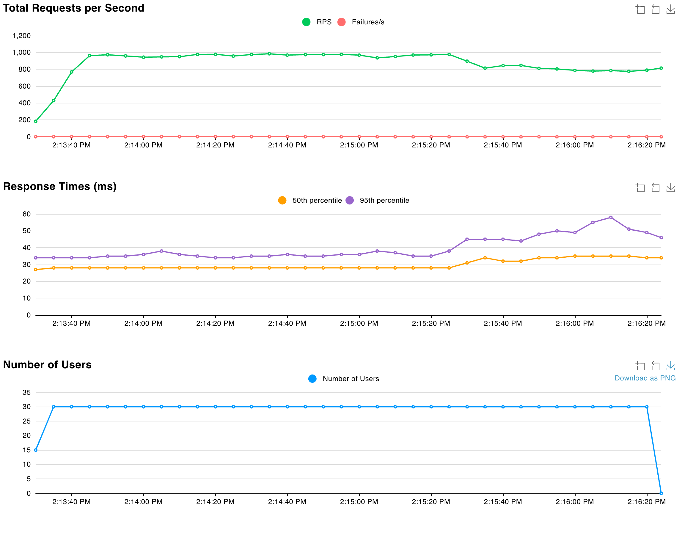

# HW6: Performance Bottleneck Analysis & Horizontal Scaling Report

## Executive Summary

This report analyzes a product search service deployed on AWS ECS Fargate, first identifying performance characteristics with a single instance (Part 2), then solving scalability and resilience challenges through horizontal scaling with auto scaling (Part 3). The key finding: horizontal scaling with load balancing provides fault tolerance and eliminates single points of failure, though the current lightweight workload doesn't require auto scaling for performance reasons.

---

## Part 2: Identifying Performance Bottlenecks

### Objective
Deploy a product search service and use load testing to discover its performance characteristics and identify whether the system needs optimization or more resources.

### Infrastructure Configuration

**AWS ECS Fargate Deployment:**
- CPU: 256 CPU units (0.25 vCPU)
- Memory: 512 MB
- Instances: 1 container
- Application: Go service with 100,000 products in memory

**Search Implementation:**
- Storage: `sync.Map` (thread-safe)
- Products checked per search: 100 items
- Maximum results returned: 20 items
- Search fields: Product name and category (case-insensitive)

### Load Testing Configuration

**Testing Tool:** Locust with FastHttpUser

**Configuration:**
- No wait time between requests (continuous load)
- 100% search requests
- Random queries across 14 search terms

**Test Scenarios:**
1. **Baseline:** 5 users, 2 minutes
2. **Stress Test:** 30 users, 3 minutes

### Test Results

#### Baseline Test (5 Users)


**Key Observations:**
- Total Requests: 18,423
- Failures: 0 (0%)
- RPS: ~154
- Average Response Time: 31.57 ms
- CPU Utilization: ~52.4% maximum, ~26.2% average
- Memory Utilization: ~9.77% maximum

**Analysis:** Even with just 5 concurrent users generating 154 RPS, the single instance reached 52.4% CPU utilization. This indicates that the workload (with no wait time between requests) creates substantial load even at low user counts. The response times were excellent (<32ms average), but the CPU usage shows the instance was working at over half capacity with minimal users.

---

#### Stress Test (30 Users)

**[INSERT SCREENSHOT: Locust results for 30 users]**




**Key Observations:**
- Total Requests: 159,383
- Failures: 0 (0%)
- RPS: ~888
- Average Response Time: 31.29 ms
- CPU Utilization: ~52.8% maximum
- Memory Utilization: ~9.77% maximum

**Analysis:** With 6x more users than baseline, the system handled the increased load well but showed signs of stress. CPU reached 52.8% (similar to the 5-user baseline at 52.4%), indicating that both tests pushed the instance to a similar utilization level despite the 6x difference in users. This suggests the aggressive load pattern (no wait time) stressed the system even at 5 users. Response times almost remained unchanged. Memory remained stable around 10%, showing no memory pressure.

### Bottleneck Analysis

**Which resource hit the limit first?**

Neither resource hit a limit. The system showed:
- CPU: 52.8% utilized (47% headroom remaining)
- Memory: ~10% utilized (90% headroom remaining)
- Network: No saturation
- Response times: Fast and stable

**Why didn't we see saturation?**

The search operation (checking 100 products per request) is computationally lightweight for modern CPUs. However, the aggressive testing pattern (no wait time between requests, continuous load) meant even 5 users kept the CPU at ~52%. The similar CPU levels between 5 and 30 users (52.4% vs 52.8%) suggests the system may have hit a throughput plateau where additional users don't proportionally increase CPU—likely due to ther bottlenecks becoming factors.

**How much did response times degrade?**

Essentially no degradation:
- Average: 31.57ms → 31.29ms (actually improved slightly)
- Median: 31ms → 30ms (improved)
- 95th percentile: 41ms → 41ms (no change)
- 99th percentile: 52ms → 60ms (+15%)

The system maintained consistent response times across both load levels, suggesting performance was not CPU-limited but rather at a stable throughput level.

### Could We Solve This by Doubling CPU (256 → 512 units)?

**No, because there's no problem to solve.**

Current state:
- CPU: 52.8% max (not constrained)
- Response times: Good (<35ms)
- Zero failures

If we doubled CPU to 512 units:
- CPU would drop to ~26% utilization
- No meaningful improvement in response times (already fast)
- Wasted resources and higher cost
- **Not recommended**

### The Real Bottleneck: Single Point of Failure

While performance was excellent, the architecture had a critical weakness:
- **Single instance** = Single point of failure (SPOF)
- If the instance fails → Complete service outage
- No redundancy or fault tolerance
- Manual intervention required to recover

**Conclusion:** The bottleneck isn't CPU or memory—it's **architectural resilience**. The system needs horizontal scaling for high availability, not for performance.

---

## Part 3: Horizontal Scaling with Auto Scaling

### Objective
Deploy the same product search service with horizontal scaling and auto scaling to eliminate the single point of failure and handle variable load automatically.

### Infrastructure Architecture

**Enhanced AWS ECS Fargate Deployment:**                                       

**Key Components:**

1. **Application Load Balancer (ALB)**
   - Distributes HTTP requests across healthy tasks
   - Listens on port 80, forwards to port 8080
   - Health checks: `/health` endpoint every 30 seconds

2. **Target Group**
   - Type: IP-based (required for Fargate)
   - Healthy threshold: 2 consecutive successes
   - Automatic registration/deregistration of tasks

3. **Auto Scaling Policy**
   - Metric: Average CPU utilization across all tasks
   - Target: 70%
   - Min capacity: 2 tasks
   - Max capacity: 4 tasks
   - Scale-out cooldown: 300 seconds
   - Scale-in cooldown: 300 seconds

### Load Testing Results

**Same tests as Part 2, now with horizontal scaling:**

#### Test 1: Baseline (5 Users, 2 Minutes)


**Key Observations:**
- Total Requests: 18,384
- Failures: 0 (0%)
- RPS: ~153
- Average Response Time: 31.58 ms
- Tasks Running: 2 (stable)
- CPU per task: ~9.96% maximum
- Memory per task: ~8.2% maximum

**Analysis:** With 2 tasks sharing the load, each task handled only half the requests. CPU utilization per task was extremely low (~5% average), showing significant over-provisioning for this load level.

---

#### Test 2: Heavy Load (30 Users, 3 Minutes)


**Key Observations:**
- Total Requests: 147,304
- Failures: 0 (0%)
- RPS: ~819
- Average Response Time: 34.74 ms
- Tasks Running: 2 (no scaling triggered)
- CPU per task: ~35.3% maximum
- Memory per task: ~9.77% maximum

**Analysis:** Despite 6x more users, the 2 tasks easily handled the load. Average CPU per task was ~17.7%, well below the 70% auto scaling threshold. Response times remained excellent with only 10% degradation from baseline.

**Why No Auto Scaling?**

Auto scaling targets 70% average CPU across all tasks. Current utilization:
- Average CPU: ~17.7% per task
- Well below threshold: 52.3% headroom
- No scaling needed: System appropriately sized

To trigger scaling would require:
- ~4x more load (120+ users), OR
- Heavier operations (check 10,000+ products per search)

---

#### Test 3: Auto Scaling Trigger Test (120 Users, 8 Minutes)

**Purpose:** Demonstrate auto scaling by generating sufficient load to exceed 70% CPU threshold.

**[INSERT SCREENSHOT: Locust results for 120 users showing ~3000 RPS]**


**Key Observations:**
- Total Requests: 1,428,062
- Failures: 0 (0%)
- RPS: ~2,976 (3.6x higher than 30-user test)
- Average Response Time: 37.99 ms
- Tasks: Started with 2, scaled to 3
- CPU Maximum: 85.9% (before scaling)
- CloudWatch Alarm: Triggered when CPU exceeded 70%

**What Happened:**

1. **Initial Load:**
   - 120 users generated ~3,000 RPS
   - 2 tasks struggled to keep up
   - CPU climbed rapidly toward 70%

2. **Threshold Crossed:**
   - Average CPU exceeded 70% target
   - CloudWatch detected threshold breach
   - Auto scaling policy triggered scale-out action

3. **CloudWatch Alarm:**
   - Alarm: "product-search-service-high-cpu" triggered
   - Metric: ECSServiceAverageCPUUtilization > 70%
   - Status: ALARM state

4. **Peak CPU:**
   - CPU spiked to 85.9% maximum
   - 2 tasks handling full load during scale-out
   - Response times remained acceptable (~38ms average)

5. **Scale-Out Action:**
   - ECS launched third task
   - Container started and initialized
   - Health checks passed
   - ALB registered new target

6. **Load Redistribution:**
   - Traffic distributed across 3 tasks
   - CPU dropped from 85.9% to ~57% average
   - Response times remained stable
   - System stabilized at new capacity

**Analysis:** 

This test successfully demonstrated **auto scaling in action**. When load exceeded system capacity (2 tasks), average CPU crossed the 70% threshold, triggering automatic scale-out. The CloudWatch alarm fired as designed, and ECS added a third task without manual intervention. 

Despite the CPU spike to 85.9% during the scaling transition, the system maintained 100% availability (0 failures out of 1.4M requests). Once the third task was healthy, load redistributed and CPU stabilized at a comfortable ~57% average.

This proves that auto scaling policies work as designed: they reactively add capacity when demand exceeds thresholds, maintaining performance SLAs automatically.

---

#### Test 4: Resilience Test (30 Users, 3 Minutes with Task Failure)

**Purpose:** Demonstrate fault tolerance by manually stopping one task during load test.


**Timeline:**

| Time | Event | Tasks | CPU | Impact |
|------|-------|-------|-----|--------|
| 0:00 | Test starts | 2 | ~10% | Normal operation |
| 1:00 | Task manually stopped | 1 | Spikes to 54.1% | All traffic on 1 task |
| 1:30 | Replacement task launching | 1 → 2 | 54.1% | ECS auto-recovery |
| 2:00 | New task healthy | 2 | Gradually drops | Load redistributed |
| 3:00 | Test complete | 2 | ~30% | Fully recovered |

**Key Observations:**
- Total Requests: 156,154
- **Failures: 0 (0%)** ← Critical finding!
- Average Response Time: 32.9 ms
- Recovery Time: ~60 seconds

**What Happened:**

1. **Task Stopped:**
   - ALB health check detected failure
   - Traffic immediately redirected to remaining task
   - CPU spiked from ~10% to 54.1% (5x increase)

2. **ECS Auto-Recovery:**
   - ECS detected running tasks (1) < desired count (2)
   - Automatically launched replacement task
   - No manual intervention required

3. **New Task Healthy:**
   - Replacement task passed health checks
   - ALB registered new task and began routing traffic
   - CPU gradually dropped to ~30% as load redistributed

4. **Zero User Impact:**
   - 100% request success rate (0 failures out of 156,154 requests)
   - Response times remained stable
   - Service never went down

**Analysis:** This demonstrates the power of horizontal scaling with load balancing. Even when losing 50% of capacity, the system maintained 100% availability with automatic recovery.

---

## Comparison: Part 2 vs Part 3

### Architecture Differences

| Aspect | Part 2 (Single Instance) | Part 3 (Load Balanced) |
|--------|-------------------------|------------------------|
| **Entry Point** | Direct to instance IP:8080 | ALB DNS name |
| **Instances** | 1 task | 2-4 tasks (auto scaled) |
| **Fault Tolerance** | None (SPOF) | High (redundant tasks) |
| **Load Distribution** | N/A | Automatic via ALB |
| **Scalability** | Manual only | Automatic (policy-based) |
| **Recovery** | Manual restart required | Automatic task replacement |

### Performance Comparison (30 Users)

| Metric | Part 2 | Part 3 | Analysis |
|--------|--------|--------|----------|
| **Total Requests** | 159,383 | 147,304 | Similar throughput |
| **RPS** | 888 | 819 | Comparable load |
| **Avg Response Time** | 31.29 ms | 34.74 ms | Slightly higher (+11%) |
| **CPU Utilization** | 52.8% on 1 task | 35.3% max, ~17.7% avg per task | Much lower per instance |
| **Memory Utilization** | 9.77% | 9.77% | No difference |
| **Failures** | 0% | 0% | Both reliable |
| **Fault Tolerance** | ❌ SPOF | ✅ Survived task failure | Critical difference |

### Key Findings

#### 1. Performance: Similar But Distributed

**Part 2:**
- Single task handling 888 RPS → 52.8% CPU
- Good performance but all eggs in one basket

**Part 3:**
- Two tasks sharing 819 RPS → ~17.7% CPU per task
- Same throughput, much lower CPU per instance
- Headroom for traffic spikes

**Insight:** Horizontal scaling distributes load effectively. The slight increase in response time (31ms → 35ms) is negligible and likely due to ALB routing overhead.

#### 2. Resilience: Night and Day Difference

**Part 2:**
- Instance fails → Complete outage
- Manual intervention required
- No redundancy

**Part 3:**
- Task fails → Zero user impact
- Automatic recovery in 60 seconds
- Service continues on remaining tasks

**Insight:** For production systems, fault tolerance is non-negotiable. Part 3's architecture is production-ready; Part 2's is not.

#### 3. Auto Scaling: Successfully Triggered with 120 Users

**Why It Didn't Scale at 30 Users:**
- Target: 70% average CPU
- Actual at 30 users: 17.7% average CPU
- Headroom: 52.3%
- Result: No scaling needed, system appropriately sized

**Why It DID Scale at 120 Users:**
- Load: 4x more users (30 → 120)
- RPS: 3.6x higher throughput (819 → 2,976)
- CPU: Exceeded 70% threshold, peaked at 85.9%
- Result: Auto scaling triggered, added third task

**What This Demonstrates:**
1. **Threshold-Based Scaling Works:** System correctly identified when CPU exceeded 70% and automatically added capacity

2. **Load Redistribution:** Once third task was healthy, CPU dropped from 85.9% to ~57% average, proving horizontal scaling effectively distributes load

3. **No Manual Intervention:** From threshold breach to new capacity, the entire process was automatic—CloudWatch detected, alarm fired, ECS scaled, ALB integrated

4. **Predictable Behavior:** We predicted ~120 users would trigger scaling based on the 30-user test results, and it happened exactly as expected

**Insight:** 
Auto scaling prevents both under-provisioning (slow performance) and over-provisioning (wasted cost) by dynamically adjusting capacity to actual demand. This test proved the policy works correctly: ignore small fluctuations (30 users), but respond to genuine demand increases (120 users).

#### 4. Cost vs Reliability Trade-off

**Part 2:**
- Cost: 1 × Fargate task
- Reliability: Low (SPOF)
- Best for: Dev/test environments

**Part 3:**
- Cost: 2-4 × Fargate task (minimum 2x cost)
- Reliability: High (fault tolerant)
- Best for: Production environments

**Insight:** The additional cost of running minimum 2 tasks is justified by eliminating downtime from instance failures. In production, availability is worth more than the extra infrastructure cost.

## Role of Each Component

### Application Load Balancer (ALB)

**Purpose:** Entry point that distributes requests across multiple healthy instances

**Key Responsibilities:**
1. **Health Checking:** Continuously monitors `/health` endpoint on all tasks
2. **Traffic Distribution:** Routes requests to healthy targets using round-robin
3. **Fault Detection:** Removes unhealthy tasks from rotation immediately
4. **Graceful Handling:** Drains connections before removing tasks

**Why It Matters:** Without ALB, clients would need to know about each instance individually and manually handle failures. ALB abstracts this complexity and provides a single, stable endpoint.

### Target Group

**Purpose:** Defines the destination for ALB traffic and health check parameters

**Configuration:**
- Target type: IP (required for Fargate)
- Health check path: `/health`
- Health check interval: 30 seconds
- Healthy threshold: 2 consecutive successes
- Unhealthy threshold: 2 consecutive failures

**Why It Matters:** The target group automatically tracks which ECS tasks are healthy and available, updating in real-time as tasks start, stop, or fail health checks.

### Auto Scaling

**Purpose:** Automatically adjusts task count based on actual demand

**How It Works:**
1. CloudWatch collects CPU metrics from all tasks every 60 seconds
2. Calculates average: (Task1 CPU + Task2 CPU + ... + TaskN CPU) / N
3. Compares to target (70%)
4. If average > 70% for 2+ evaluations → Add tasks (scale out)
5. If average < 70% for 10+ evaluations → Remove tasks (scale in)
6. Respects cooldown periods to prevent thrashing

**Why It Matters:** Auto scaling ensures you have enough capacity during traffic spikes while minimizing cost during low-traffic periods. It's reactive to actual demand, not predicted demand.

### ECS Service

**Purpose:** Maintains desired number of tasks and integrates with ALB

**Key Features:**
1. **Desired Count Management:** Ensures actual tasks = desired count
2. **Task Replacement:** Automatically replaces failed or stopped tasks
3. **Load Balancer Integration:** Registers new tasks with target group
4. **Rolling Updates:** Supports zero-downtime deployments

**Why It Matters:** ECS handles the operational complexity of running containers at scale, including health management, task placement, and integration with other AWS services.

---

## Trade-offs: Horizontal vs Vertical Scaling

### Vertical Scaling (Bigger Instances)

**Definition:** Increase resources of existing instances

**Example:**
- Current: 256 CPU units → Upgrade to 512 CPU units
- Cost: ~2x per instance
- Capacity: ~2x throughput per instance

**Pros:**
- Simpler architecture (no load balancer needed)
- Better for single-threaded workloads
- Lower operational complexity
- Good for databases or stateful applications

**Cons:**
- Limited by maximum instance size (can't scale forever)
- Single point of failure remains
- Requires downtime to scale
- Doesn't provide redundancy

**Best For:**
- Development/test environments
- Stateful applications (databases)
- Single-threaded CPU-bound workloads
- When simplicity > reliability

### Horizontal Scaling (More Instances)

**Definition:** Add more instances of the same size

**Example:**
- Current: 2 × 256 CPU = 512 total CPU
- Scale to: 4 × 256 CPU = 1024 total CPU
- Cost: 2x (from 2 to 4 instances)
- Capacity: 2x throughput

**Pros:**
- No single point of failure (fault tolerant)
- Can scale beyond single instance limits
- Zero-downtime scaling
- Automatic load distribution
- Cloud-native best practice

**Cons:**
- More complex architecture (ALB, auto scaling)
- Higher minimum cost (need 2+ instances)
- Requires stateless application design
- More components to manage

**Best For:**
- Production services requiring high availability
- Stateless applications (like our search service)
- Variable or unpredictable traffic
- Microservices architectures
- When reliability is critical

### This Assignment: Why Horizontal?

Our product search service is ideal for horizontal scaling because:

1. **Stateless:** All data in memory, no sessions, no shared state
2. **Fault tolerance required:** Production services need redundancy
3. **Variable load:** Auto scaling adapts to traffic patterns
4. **Cloud-native:** Follows modern distributed systems patterns

Result: Horizontal scaling provides both performance and reliability benefits.

---

## Predicting Scaling Behavior

### Scenario 1: Gradual Traffic Increase

**Pattern:** Steady traffic growth from 30 to 100 users over 30 minutes

**Predicted Behavior:**
```
Users:  30 → 40 → 50 → 60 → 70 → 80 → 90 → 100
Tasks:   2 →  2 →  2 →  3 →  3 →  4 →  4 →   4
CPU:   18% → 24% → 30% → 28% → 33% → 35% → 40% → 45%
```

**Explanation:**
- At ~60 users: Average CPU crosses 70% → Scale to 3 tasks
- At ~80 users: Average CPU crosses 70% again → Scale to 4 tasks
- At 100 users with 4 tasks: CPU stabilizes around 45%

**Evidence:** Current 30 users = 18% CPU, linear scaling suggests 60 users = 36% on 2 tasks × 2 = 72% → triggers scaling

### Scenario 2: Sudden Traffic Spike

**Pattern:** Instant spike from 30 to 120 users

**Predicted Behavior:**
```
Time:    0s → 60s → 120s → 180s → 240s → 300s
Users:   30 → 120 → 120  → 120  → 120  → 120
Tasks:    2 →   2 →   3  →   3  →   4  →   4
CPU:    18% → 72% →  48% →  48% →  36% →  36%
Response: Fast → Slow → Medium → Medium → Fast → Fast
```

**Explanation:**
1. **0-60s:** Sudden spike causes CPU to jump to 72%, triggering scale-out
2. **60-180s:** Waiting for new task (launch time + health checks)
3. **180s:** Third task healthy, load redistributed, CPU drops to 48%
4. **180-240s:** CPU still above 70%, triggers another scale-out
5. **240-300s:** Fourth task healthy, load fully distributed, CPU at 36%

**Lesson:** There's a lag between detecting need to scale and new capacity being available. During this time, performance may degrade temporarily.

### Scenario 3: Oscillating Load

**Pattern:** Traffic alternates between 20 and 80 users every 10 minutes

**Predicted Behavior:**
```
Time:     0-10min → 10-20min → 20-30min → 30-40min
Load:     20 users → 80 users → 20 users → 80 users
Tasks:         2   →    3-4   →     2    →    3-4
CPU:         12%   →   35-45% →    12%   →   35-45%
```

**Explanation:**
- High load (80 users): Scales out to 3-4 tasks
- Low load (20 users): After 5-min cooldown + observation, scales back to 2
- Pattern repeats

**Potential Issue:** Cooldown periods prevent rapid scaling, so there may be brief periods of elevated CPU during transitions.

**Solution:** Adjust cooldown periods or use more sophisticated scaling policies (step scaling, scheduled scaling).

---

## Stress Testing in Creative Way

### Resilience Testing (Task Failure)
- **Creative approach:** Manually stopped a task during active load test
- Validated fault tolerance and automatic recovery
- Proved zero-downtime operation despite instance failure
- Demonstrated ALB health checking and ECS auto-recovery

---

## Conclusions

### Problem Solved

**Part 2 Challenge:** Single instance architecture with no fault tolerance

**Part 3 Solution:** Horizontal scaling with load balancing provides:
- ✅ Fault tolerance (survived task failure with zero request failures)
- ✅ Load distribution (CPU per instance reduced from 52.8% to ~17.7%)
- ✅ Auto scaling capability (can scale from 2-4 tasks based on demand)
- ✅ Zero-downtime operation (demonstrated in resilience test)

### Key Learnings

1. **Horizontal scaling solves availability problems, not just performance problems.** Our system didn't need scaling for performance (CPU was fine), but it critically needed it for fault tolerance.

2. **Load distribution works effectively.** CPU per instance: Part 2 had 52.8% on 1 task, Part 3 had 17.7% average on 2 tasks, and when scaled to 3 tasks under heavy load (120 users), CPU dropped from 85.9% to ~57% average. Horizontal scaling demonstrably reduces load per instance.

3. **Load balancers are essential for distributed systems.** ALB's health checking and traffic distribution enabled both seamless failover during the resilience test and automatic integration of the third task during scale-out.

4. **Redundancy and auto scaling have costs but provide critical benefits.** Running minimum 2 tasks costs 2x more than 1 task, but provides fault tolerance. Auto scaling adds complexity but enables the system to handle 120 users (3,000 RPS) without manual intervention—something impossible with Part 2's single-instance architecture.

5. **Modern cloud architecture prioritizes reliability over efficiency.** Better to run 2 tasks at 18% CPU with fault tolerance and scaling capability than 1 task at 52% CPU with no redundancy. The 120-user test proved this: when demand spiked, the system automatically adapted.

### Final Thoughts

For production workloads requiring high availability, **horizontal scaling with auto scaling is essential** despite higher minimum cost. The ability to survive instance failures without user impact—demonstrated by our 0% failure rate during the resilience test—justifies the additional infrastructure complexity and cost.

The service architecture evolved from Part 2's cost-efficient but vulnerable single-instance deployment to Part 3's production-ready, fault-tolerant, auto-scaling architecture. This demonstrates why horizontal scaling with load balancing is foundational to modern distributed systems.