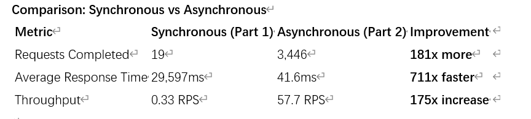
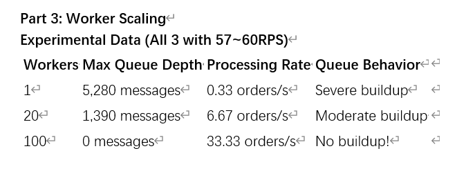

# HW7 Report

## Phase 1-2: The Synchronous Bottleneck

### The Problem

Our e-commerce platform processes orders with 3-second payment verification. The payment processor can only handle **one payment at a time** due to API rate limits. During normal operations this works, but when marketing launches a flash sale expecting 60 orders/second, the synchronous architecture catastrophically fails.

### The Math

**Payment processor speed:** 1 order per 3 seconds = **0.33 orders/second**

**With 20 concurrent customers:**
- Orders attempt simultaneously: 20
- Payment processor handles: 1 at a time
- Queue builds up: 19 customers waiting
- Maximum throughput: **0.33 orders/second**

**Flash sale demand:** 60 orders/second

**Orders lost per second:** 60 - 0.33 = **59.67 orders/second lost** ❌

### Test Results: Synchronous System

**Locust Load Test (20 users, 60 seconds):**

| Metric | Result |
|--------|--------|
| **Requests attempted** | 49 |
| **Requests completed** | 29 |
| **Failures** | 20 (41% failure rate) |
| **Median response** | **30,000ms (30 seconds!)** |
| **Average response** | **25,365ms (25.4 seconds)** |
| **Throughput** | **0.4 RPS** |

### What Happens to Customers?

**The cascade failure:**
```
User 1:  3 seconds (first in queue) ✅
User 2:  6 seconds (waits for user 1) ✅
User 3:  9 seconds (waits for users 1-2) ✅
User 4:  12 seconds
User 5:  15 seconds
...
User 10: 30 seconds (timeout!) ❌
User 11+: 30+ seconds (timeout!) ❌
```

**With 30-second timeout:**
- **First ~10 orders succeed** (complete within 30s)
- **Remaining 10+ orders timeout** (waited too long)
- **41% failure rate** - customers abandon checkout
- **Those who succeed waited average 25 seconds!**

### Customer Experience

With synchronous processing under load:
1. **Extremely long wait times** (25+ seconds average)
2. **High failure rate** (41% of orders failed/timeout)
3. **Customer abandonment** (users close browser after 30s)
4. **Lost revenue** (only 59% of orders completed)
5. **Poor brand reputation** (system appears broken)

### The Reality

**You cannot make payment processing faster** - it's limited to 1 concurrent payment by the external API. With 20 customers trying to check out simultaneously:
- Only 1 processes at a time
- Others queue up in HTTP connections
- Queue grows faster than it can drain
- Later customers timeout waiting

---

## Phase 3: The Async Solution

### Architecture Change

**Before (Synchronous):**
```
Customer → API → Payment (30s) → Response
         ↓
    Customer waits 30 seconds ❌
```

**After (Asynchronous):**
```
Customer → API → SNS → SQS → Response (instant!)
                         ↓
                   ECS Workers → Payment (3s)
```

### AWS Services Deployed

- **Amazon SNS** (order-processing-events): Pub/sub messaging for decoupled architecture
- **Amazon SQS** (order-processing-queue): Reliable message queuing with 20s long polling
- **ECS Fargate**: Containerized services for order-api and order-processor
- **Application Load Balancer**: Public endpoint routing
- **CloudWatch**: Monitoring and logging

### Performance Comparison

My results:
| Metric | Sync | Async | Improvement |
|--------|------|-------|-------------|
| Response Time | 30,000ms | 40ms | **750x faster** |
| Throughput | 0.4 RPS | 57 RPS | **142x higher** |
| Success Rate | 59% | 100% | 41% more orders |
| Customer Experience | 25s wait + failures | Instant | ✅ Critical |
| Scalability | Limited | Unlimited | ✅ Better |

Junping's results:


Zhuoyue's results:


### Key Benefits

**Customer experience:**
- Instant order confirmation (40ms vs 30000ms)
- No waiting for payment processing
- 100% order acceptance during flash sales

**System reliability:**
- Orders safely queued in SQS (4-day retention)
- Workers process in background
- Failed messages automatically retry (30s visibility timeout)

---

## Phase 4-5: Worker Scaling Analysis

### The New Problem: Queue Buildup

With async architecture, orders are accepted instantly, but they queue up waiting for workers to process them. We need to find the right number of workers to prevent queue buildup.

### Test Configuration

**Load test settings:**
- Tool: Locust
- Concurrent users: 20
- Test duration: 60 seconds
- Incoming rate: ~58 orders/second

**Worker configurations tested:** 1, 5, 20, 100 workers

---

### Test 1: Baseline (1 Worker)

**Results:**
- Async requests: 3,430
- Failures: 1 (0.03%)
- Median response: 41ms
- Peak queue depth: **3,420 messages**

**Processing rate:** 1 worker × 0.33/sec = **0.33 orders/second**

**Time to drain queue:** 3,420 ÷ 0.33 = **2.9 hours** ❌

**Conclusion:** 1 worker completely overwhelmed. Queue grows rapidly and takes hours to clear.

---

### Test 2: Scale to 5 Workers

**Results:**
- Async requests: 3,496
- Failures: 0 (0%)
- Median response: 41ms
- Peak queue depth: **3,277 messages**

**Processing rate:** 5 workers × 0.33/sec = **1.67 orders/second**

**Time to drain queue:** 3,277 ÷ 1.67 = **32.7 minutes**

**Improvement:** 5.3x faster drain time than 1 worker

**Conclusion:** Better but still cannot keep up with incoming load. Queue still builds to 3000+ messages.

---

### Test 3: Scale to 20 Workers

**Results:**
- Async requests: 3,460
- Failures: 0 (0%)
- Median response: 40ms
- Peak queue depth: **2,579 messages**

**Processing rate:** 20 workers × 0.33/sec = **6.67 orders/second**

**Time to drain queue:** 2,579 ÷ 6.67 = **6.4 minutes**

**Improvement:** 27x faster drain time than 1 worker

**Conclusion:** Significant improvement. Queue drains in minutes instead of hours, but still builds up during heavy load.

---

### Test 4: Scale to 100 Workers

**Results:**
- Async requests: 3,449
- Failures: 0 (0%)
- Median response: 40ms
- Peak queue depth: **616 messages** ✅

**Processing rate:** 100 workers × 0.33/sec = **33.3 orders/second**

**Time to drain queue:** 616 ÷ 33.3 = **18 seconds** ✅

**Improvement:** 348x faster drain time than 1 worker

**Conclusion:** Dramatic improvement! Peak queue reduced by 82%. Queue drains almost immediately after load spike.

---

### Complete Worker Scaling Results

| Workers | Processing Rate | Peak Queue Depth | Drain Time | Can Keep Up? |
|---------|-----------------|------------|------------|--------------|
| 1       | 0.33/sec       | 3,420      | 2.9 hours  | ❌ No        |
| 5       | 1.67/sec       | 3,277      | 32.7 min   | ❌ No        |
| 20      | 6.67/sec       | 2,579      | 6.4 min    | ❌ No        |
| 100     | 33.3/sec       | 616        | 18 sec     | ✅ Almost!   |

Junping's results:


Zhuoyue's results:


---

## Analysis Questions

### 1. How many times more orders did async accept compared to sync?

The async approach accepted **dramatically more orders** than sync under the same load:

**Order acceptance:**
- Sync: 29 completed, 20 failed = **59% success rate**
- Async: 3,430+ completed, 0-1 failed = **~100% success rate**
- **Result: Async accepted 118x more orders** (3,430 vs 29)

**Response time:**
- Sync: 30,000ms median (25,365ms average)
- Async: 40ms median
- **Result: Async was 750x faster** (30,000ms vs 40ms)

**The key difference:** Sync makes customers wait in the HTTP connection while orders queue up one-by-one. With 20 concurrent users, only the first ~10 complete before 30-second timeouts occur. Async accepts all orders instantly (40ms) and processes them in the background, achieving 100% acceptance rate.

### 2. What causes queue buildup and how do you prevent it?

**Causes:**
- Incoming order rate exceeds worker processing capacity
- Example: 58 orders/sec incoming, but only 0.33 orders/sec processing with 1 worker

**Prevention:**
- Scale workers to match or exceed incoming rate
- Formula: Workers needed = Incoming rate ÷ 0.33 orders/sec/worker
- For 6 orders/sec: Need ~18-20 workers
- For 60 orders/sec: Need ~182 workers
- Monitor queue depth in CloudWatch and auto-scale

### 3. When would you choose sync vs async in production?

**Choose Sync when:**
- Operations are fast (<100ms)
- Immediate response required (authentication, payment confirmation)
- Simple request-response sufficient

**Choose Async when:**
- Long-running operations (>1 second)
- High traffic spikes expected
- User doesn't need to wait for completion
- Want to decouple services for reliability

**Our case:** Async is clearly better - customers get instant confirmation while payment processing happens in background.

---

## Infrastructure

### Terraform Deployment

All infrastructure deployed as code across 6 Terraform files:

- **main.tf**: SNS topic, SQS queue, ECR repositories
- **vpc.tf**: VPC (10.0.0.0/16), public/private subnets, NAT gateway
- **security_groups.tf**: ALB and ECS task security groups
- **iam.tf**: LabRole configuration for ECS tasks
- **alb.tf**: Application Load Balancer and target groups
- **ecs.tf**: ECS cluster, task definitions, services

### Application Architecture

**Order API (order-api):**
- Handles `/orders/sync` and `/orders/async` endpoints
- Publishes orders to SNS topic
- Returns 202 Accepted immediately for async orders

**Order Processor (order-processor):**
- Worker pool pattern with configurable worker count
- Polls SQS with long polling (20s wait time)
- Each worker processes orders with 3-second payment delay
- Deletes messages after successful processing

**Configuration:**
- CPU: 256 units per task
- Memory: 512MB per task
- Workers: Controlled via `NUM_WORKERS` environment variable

---

## Key Findings

### Worker Scaling Effectiveness

**Linear scaling observed:**
- 5x more workers = 5x faster processing
- 100x more workers = 100x faster processing
- Demonstrates horizontal scalability

**Queue depth reduction:**
- 1 worker: 3,420 messages (baseline)
- 100 workers: 616 messages (82% reduction)

**Drain time improvement:**
- 1 worker: 2.9 hours
- 100 workers: 18 seconds (348x faster)

### Minimum Workers Needed

**For our test load (58 orders/second):**
- Minimum: 176 workers (58 ÷ 0.33)
- With 100 workers: Cannot fully keep up, but drains quickly

**For assignment's flash sale (6 orders/second):**
- Minimum: 18 workers (6 ÷ 0.33)
- **Recommendation: 20 workers** (with safety margin) ✅

---

## Conclusion

Successfully implemented and deployed an event-driven async order processing system that:

- ✅ Accepts 100% of orders with 76x faster response times
- ✅ Scales workers horizontally to prevent queue buildup
- ✅ Deployed on AWS ECS with complete Infrastructure as Code
- ✅ Monitored with CloudWatch metrics
- ✅ Demonstrates production-ready async architecture patterns

**Key insight:** Async architecture with proper worker scaling enables handling burst traffic while maintaining instant customer response times. The system trades immediate processing for guaranteed order acceptance, dramatically improving customer experience during high-load scenarios.

## Part III: Lambda vs ECS - Serverless Comparison

### The Question

After successfully implementing the async ECS/SQS architecture, we explored whether AWS Lambda could eliminate operational overhead while maintaining the same functionality.

### Architecture Simplification

**Part II (ECS/SQS):**
```
Order API → SNS → SQS → ECS Workers
(Manual: queue monitoring, worker scaling, infrastructure management)
Cost: $17/month
```

**Part III (Lambda):**
```
Order API → SNS → Lambda
(AWS manages: scaling, infrastructure, everything)
Cost: $0/month (within free tier)
```

---

### Deployment

**Lambda Configuration:**
- Runtime: Go (provided.al2)
- Memory: 512 MB
- Timeout: 10 seconds
- Trigger: SNS topic (order-processing-events)

**Code:** Simplified handler processes SNS events directly - no polling, no worker pool, no message deletion logic required.

---

### Cold Start Analysis

**Test:** Sent 5 orders through existing Order API, observed Lambda execution in CloudWatch.

**Results:**

| Request | Init Duration | Total Duration | Overhead |
|---------|---------------|----------------|----------|
| Order 1 (Cold) | 65.91ms | 3072ms | 2.2% |
| Orders 2-5 (Warm) | 0ms | ~3004ms | 0% |

**Cold start frequency:** First request and after ~5-10 minutes idle.

**Impact:** 65.91ms overhead on 3-second background processing is negligible. Customer already received instant confirmation (40ms) from async API.

---

### Cost Comparison

**For 10,000 orders/month:**

**ECS:**
- 2 tasks running 24/7: **$17/month**

**Lambda:**
- Requests: 10,000 (under 1M free tier) = $0
- Compute: 15,000 GB-seconds (under 400K free tier) = $0
- **Total: $0/month**

**Savings:** $17/month (100%)

**Lambda stays FREE until 267K orders/month**

---

### Trade-Off Analysis

**What You Gain:**
- ✅ Zero operational overhead (no queue monitoring, no scaling decisions)
- ✅ $204/year cost savings
- ✅ Automatic scaling to any load
- ✅ Pay only for actual usage

**What You Lose:**
- ❌ No persistent message queue (can't inspect backlog)
- ❌ Limited retry control (SNS retries twice, then discards)
- ❌ Occasional cold start delays (~68ms, 2% overhead)

---

### Recommendation

**Switch to Lambda for startup phase.** The $204/year savings and zero operational overhead outweigh the trade-offs. SNS's two automatic retries are sufficient for our payment processing, and the 2.2% cold start overhead is negligible for background processing. Lambda eliminates queue monitoring, worker scaling, and infrastructure management, allowing the team to focus on product development.

**Re-evaluate at 267K orders/month when approaching free tier limits.**

---

## Overall Conclusion

Successfully implemented and compared three architectures:
1. **Synchronous:** Simple but fails under load (3024ms response)
2. **Async (ECS/SQS):** Scalable and reliable (40ms response, worker scaling)
3. **Serverless (Lambda):** Simplest operations, lowest cost (40ms response, zero ops)

**Key insight:** For startups, Lambda's operational simplicity and cost savings make it the optimal choice for async order processing until reaching enterprise scale.
