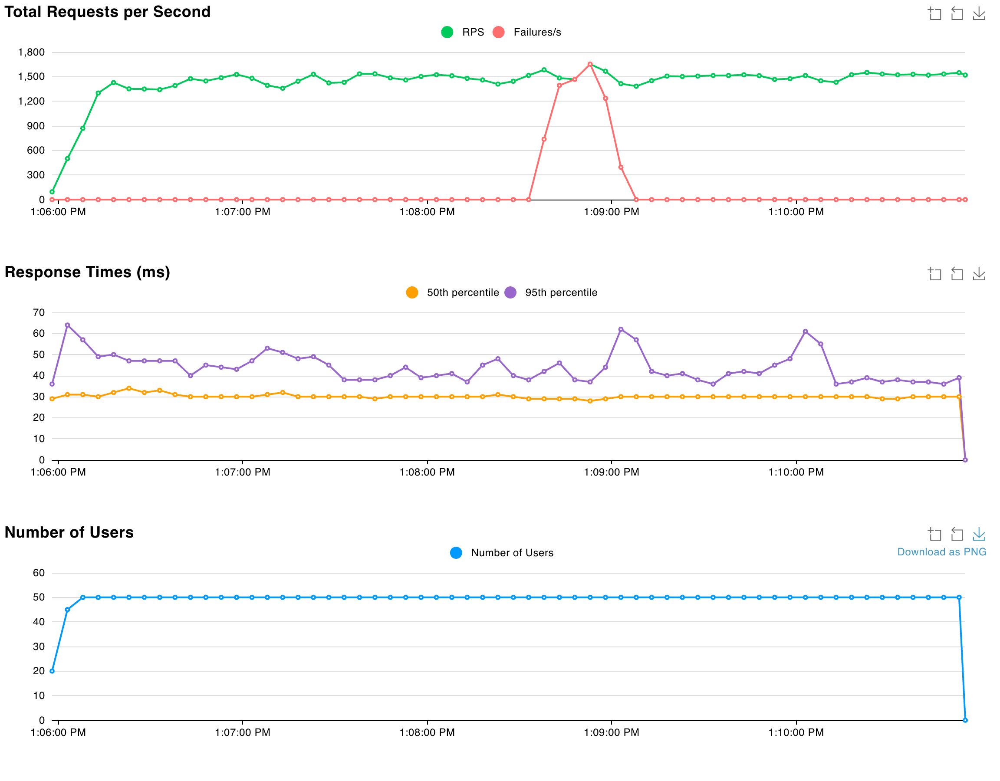
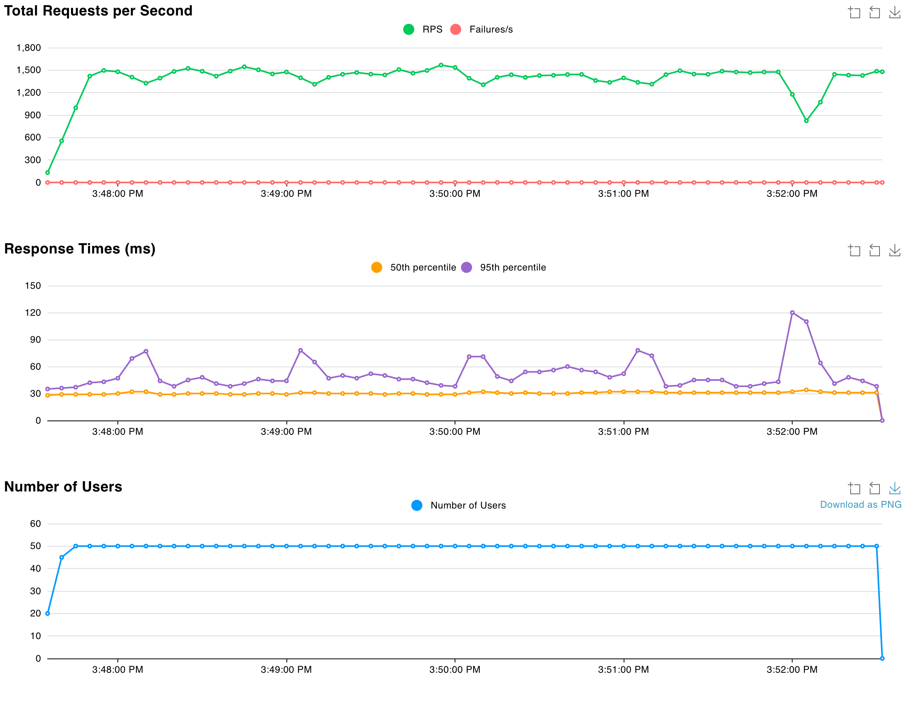
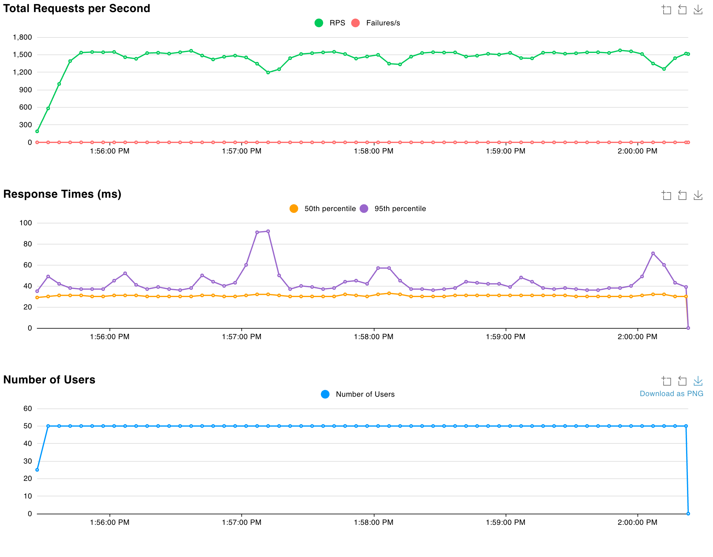
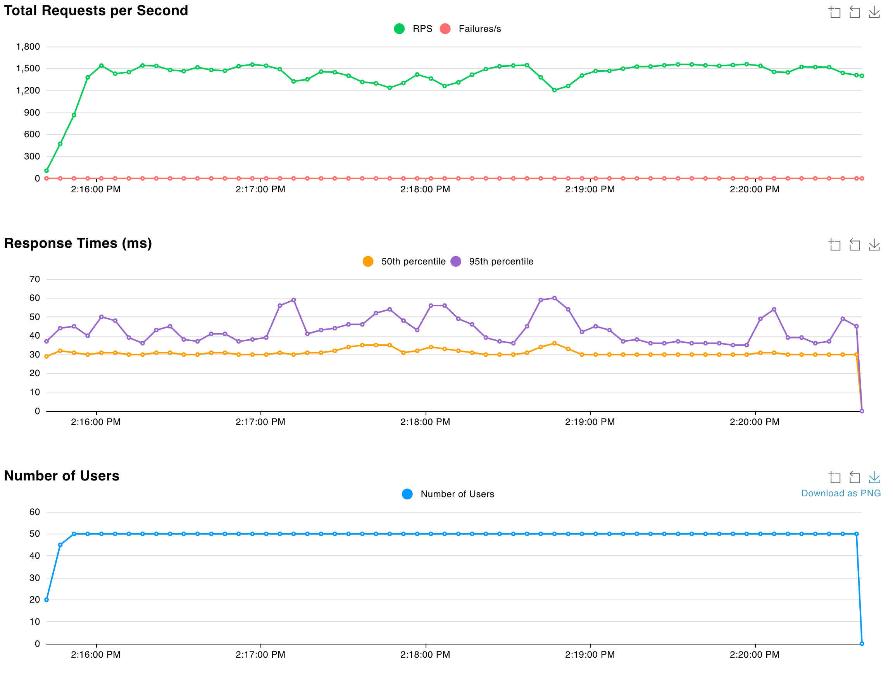
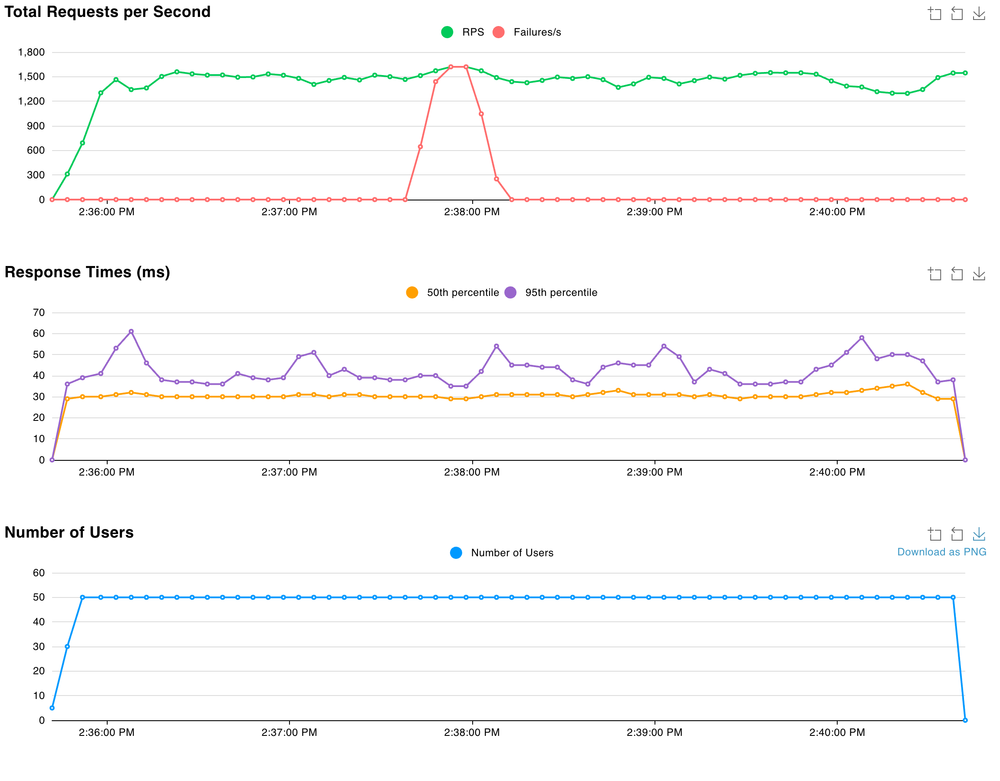

# Experiment Report: High Availability through Redundancy and Minimum Healthy Thresholds

## System Architecture

I reused the product search service from HW6, deploying it on AWS with:
- 1 ECR repository containing the Docker image
- ECS Fargate tasks for container orchestration
- 1 Application Load Balancer (ALB) for traffic distribution
- Auto-scaling group for automatic capacity management
- Locust for load testing (50 concurrent users)

**Objective:** Test system availability and recovery behavior during task failures, then implement and validate a resilience solution.

---

## Part 1: The Problem - Minimal Redundancy

### Configuration
- **ECS Tasks:** 2
- **Minimum Healthy Percentage:** 100% (default)
- **Protection:** Auto-scaling only (reactive recovery)

---

### Test 1: Simultaneous Failure

**Procedure:** After 2 minutes of stable baseline traffic, I manually stopped both ECS tasks simultaneously.

**Results:**


- **Total Requests:** 437,130
- **Failed Requests:** 34,402
- **Failure Rate:** 7.9%
- **Downtime:** ~35 seconds

**Analysis:**
Complete service unavailability occurred when both tasks stopped. The ALB had no healthy targets, causing all requests to fail with 503 errors. Auto-scaling detected the issue and launched replacement tasks, but recovery took approximately 30 seconds due to cold start time.

---

### Test 2: Cascading Failure

**Procedure:** After 1 minute of baseline, I stopped Task 1 and waited for the replacement task to become healthy (~90 seconds). I then stopped Task 2 to simulate cascading failures with sufficient recovery time between failures.

**Results:**


- **Total Requests:** 420,729
- **Failed Requests:** 0
- **Failure Rate:** 0%
- **Downtime:** 0 seconds
- **Response Time Impact:** RPS dip from 1,500 to 800; P95 latency spike to 120ms

**Analysis:**
The system survived because replacement Task 3 became healthy before Task 2 was stopped. However, this revealed a **60-90 second vulnerability window** after the first failure where the system operates with zero redundancy. If Task 2 had failed within this window, complete outage would have occurred. The brief RPS drop demonstrated the system operating at capacity limits with only one task. System survival depends on failure timing, not guaranteed redundancy.

---

## Part 2: The Solution - Over-Provisioning with Minimum Healthy Thresholds

### Configuration
- **ECS Tasks:** 3 (increased from 2)
- **Minimum Healthy Percentage:** 66%
- **Minimum Capacity (Auto-scaling):** 3
- **Protection:** Proactive capacity maintenance

**Implementation:**
```hcl
resource "aws_ecs_service" "this" {
  desired_count = 3
  deployment_minimum_healthy_percent = 66
  deployment_maximum_percent = 200
}
```

This ensures ECS maintains at least 2 healthy tasks (66% of 3), triggering immediate replacement launches when capacity falls below threshold.

---

### Test 1: Rapid Sequential Failure

**Procedure:** Stopped Task 1 after 1 minute, then stopped Task 2 within 5 seconds.

**Results:**


- **Failed Requests:** 0
- **Failure Rate:** 0%
- **Downtime:** 0 seconds
- **Response Time Impact:** Brief P95 spike to ~100ms

**Analysis:**
When the second task stopped, capacity dropped to 33% (below 66% threshold), triggering immediate launch of 2 replacement tasks. The remaining task handled all traffic for ~10 seconds with elevated latency but zero failures.

---

### Test 2: Rolling Sequential Failure

**Procedure:** Stopped all 3 tasks sequentially with 20-30 second intervals between each stop.

**Results:**


- **Total Requests:** 430,334
- **Failed Requests:** 0
- **Failure Rate:** 0%
- **Downtime:** 0 seconds

**Analysis:**
The system continuously self-healed as tasks were destroyed. By the time the 3rd original task was stopped, 2 replacement tasks were already running and healthy. The system completed full fleet replacement without user impact, demonstrating resilience against cascading failures regardless of timing.

---

### Test 3: Simultaneous Catastrophic Failure

**Procedure:** Stopped all 3 tasks simultaneously after 2 minutes.

**Results:**


- **Total Requests:** 436,954
- **Failed Requests:** 33,116
- **Failure Rate:** 7.6%
- **Downtime:** ~35 seconds

**Analysis:**
Stopping all tasks in a single action bypassed the minimum healthy threshold protection, resulting in outage similar to the 2-task configuration. However, this represents an unrealistic failure scenario—production failures occur sequentially, not simultaneously.

---

## Conclusion

### Comparison of Results

| Test Scenario | Configuration | Failed Requests | Downtime | Key Insight |
|---------------|---------------|-----------------|----------|-------------|
| **Problem: Simultaneous** | 2 tasks, 100% min | 34,402 (7.9%) | 30s | No redundancy buffer |
| **Problem: Cascading** | 2 tasks, 100% min | 0 (0%) | 0s* | 60-90s vulnerability window |
| **Solution: Rapid Failure** | 3 tasks, 66% min | 0 (0%) | 0s | Proactive capacity maintenance |
| **Solution: Rolling Failure** | 3 tasks, 66% min | 0 (0%) | 0s | No vulnerability window |
| **Solution: Simultaneous** | 3 tasks, 66% min | 33,116 (7.6%) | 35s | Unrealistic edge case |

*Survived due to lucky timing; would have failed if second task stopped within 60-90 seconds

### Key Findings

The 2-task configuration creates a critical vulnerability: a 60-90 second window after the first failure where system survival depends on timing. Production failures (memory leaks, crashes, resource exhaustion) don't respect timing windows.

The 3-task configuration with 66% minimum healthy threshold eliminates this dependency by:
- Maintaining minimum 2-task capacity at all times
- Surviving sequential failures regardless of timing
- Providing guaranteed redundancy buffer

**Resilience Pattern Applied:**
This solution combines over-provisioning (N+1 redundancy) with proactive capacity management. The 66% threshold ensures ECS maintains sufficient capacity during deployments and triggers immediate replacement when failures occur.

**Cost-Benefit Analysis:**
- Additional cost: 1 extra task (~$15/month, 50% increase)
- Availability improvement: Eliminates downtime for realistic failure scenarios
- Recovery: Timing-independent vs timing-dependent resilience

### Limitations and Future Improvements

While the 3-task solution successfully handles sequential failures, it cannot prevent downtime from simultaneous catastrophic failures. As shown in Test 3, when all 3 tasks stopped simultaneously, the system experienced 35 seconds of downtime, which is the same to the 2-task configuration's outage. This demonstrates that the solution's effectiveness depends on failure patterns:

- **For cascading failures (20-30s intervals):** The 3-task solution eliminates the 60-90 second vulnerability window entirely, as replacement tasks become healthy before subsequent failures occur.
- **For simultaneous failures:** Both configurations suffer similar downtimes (~35s), as cold start delays cannot be avoided when all capacity is lost at once.

The key improvement is that the 3-task solution handles the more realistic cascading failure scenario without timing dependencies, while the 2-task configuration relies on favorable timing (90+ second intervals) to avoid outages.

**Additional strategies for achieving true zero-downtime:**
- **Multi-AZ deployment:** Distribute tasks across multiple availability zones to survive zone-level failures
- **Pre-warmed standby tasks:** Maintain warm pool of ready tasks to eliminate cold start delays
- **Blue-green deployment:** Run parallel environments to enable instant failover
- **Cross-region redundancy:** Deploy in multiple AWS regions for disaster recovery

These approaches require additional complexity and cost but provide higher availability guarantees for mission-critical applications.

**Production Implications:**
The solution eliminates downtime for all real-world sequential failure modes at minimal additional cost, providing deterministic resilience rather than relying on favorable failure timing. For most production workloads, this represents an optimal balance between cost, complexity, and reliability.Retry